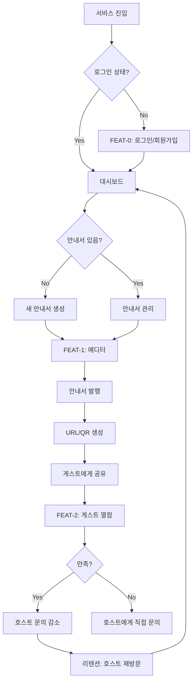
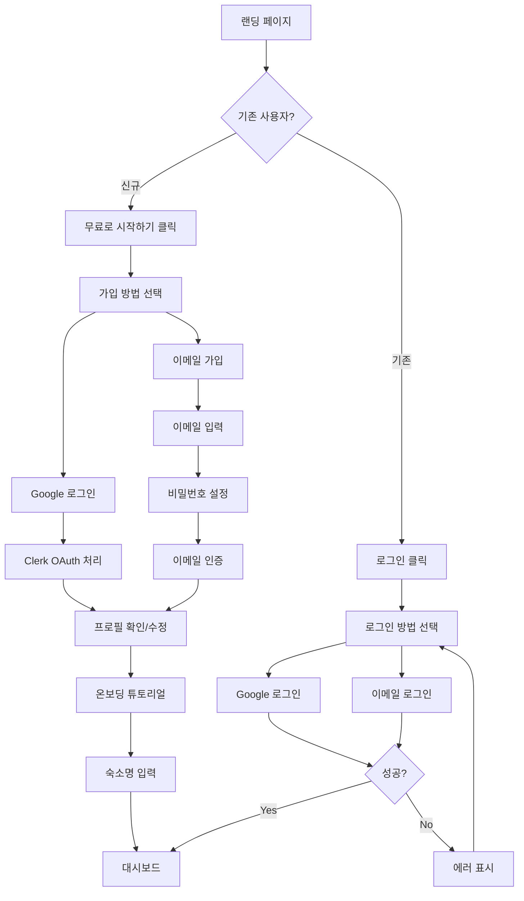
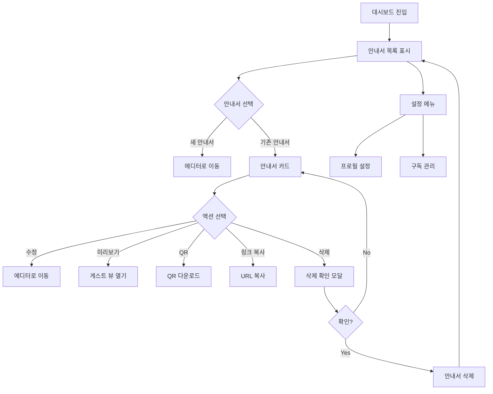
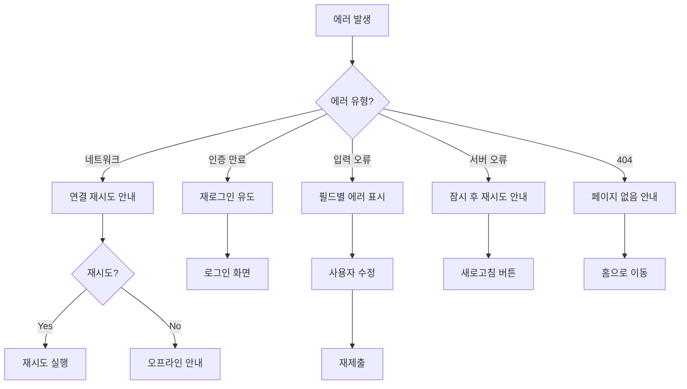
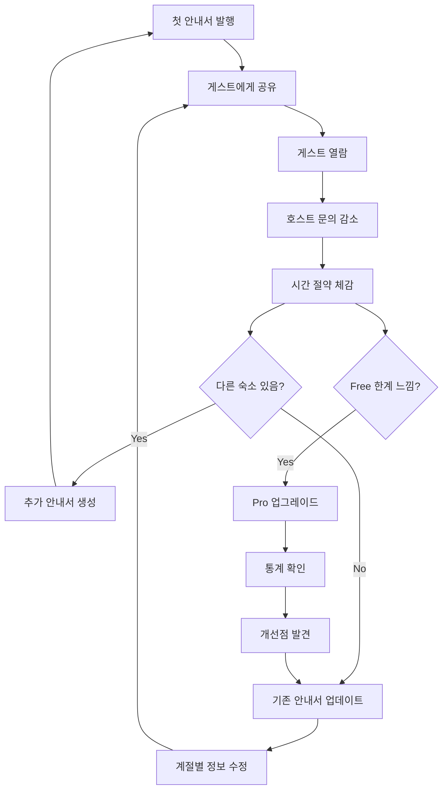

# User Flow (사용자 흐름도)

> Roomy - 에어비앤비 호스트를 위한 디지털 숙소 안내서 플랫폼

---

## MVP 캡슐

| # | 항목 | 내용 |
|---|------|------|
| 1 | 목표 | 에어비앤비 호스트가 종이 안내서 없이 디지털 안내서를 만들고 공유할 수 있게 한다 |
| 2 | 페르소나 | 부업 호스트 **[가설]** |
| 3 | 핵심 기능 | FEAT-1: 안내서 생성 및 발행 |
| 4 | 성공 지표 (노스스타) | MRR ₩100만 (6개월) |
| 5 | 입력 지표 | 발행된 안내서 수, 안내서 조회수 |
| 6 | 비기능 요구 | 게스트 뷰 < 2초 로드 |
| 7 | Out-of-scope | AI 챗봇 |
| 8 | Top 리스크 | 타겟 미검증 |
| 9 | 완화/실험 | 사용자 조사 먼저 |
| 10 | 다음 단계 | 호스트 인터뷰 5-10명 |

---

## 1. 전체 사용자 여정 (Overview)



---

## 2. FEAT-0: 온보딩/로그인 플로우



### 온보딩 단계 상세

| 단계 | 화면 | 필수/선택 | 목적 |
|------|------|----------|------|
| 1 | 가입 방법 선택 | 필수 | 계정 생성 |
| 2 | 프로필 확인 | 필수 | 기본 정보 |
| 3 | 숙소명 입력 | 필수 | 첫 안내서 준비 |
| 4 | 튜토리얼 | 선택 | 사용법 안내 (스킵 가능) |

---

## 3. FEAT-1: 안내서 생성/편집 플로우

```mermaid
graph TD
    A[대시보드] --> B["+ 새 안내서" 클릭]
    B --> C[템플릿 선택]
    C --> D[에디터 진입]

    D --> E[블록 추가]
    E --> F{블록 타입?}

    F -->|텍스트| G[텍스트 입력]
    F -->|이미지| H[이미지 업로드]
    F -->|복사| I[라벨/값 입력]
    F -->|구분선| J[구분선 추가]

    G --> K[블록 저장]
    H --> K
    I --> K
    J --> K

    K --> L{더 추가?}
    L -->|Yes| E
    L -->|No| M[미리보기 확인]

    M --> N{만족?}
    N -->|No| O[블록 수정/순서 변경]
    O --> M

    N -->|Yes| P["발행하기" 클릭]
    P --> Q[슬러그 입력 모달]
    Q --> R[URL/QR 생성 완료]

    R --> S[발행 완료 모달]
    S --> T["URL 복사" / "QR 다운로드"]
    T --> U[대시보드로 돌아가기]
```

### 에디터 화면 구성

```
┌─────────────────────────────────────────────────────────────────┐
│ ←  안내서 이름                         [저장 중...] [미리보기] [발행] │
├───────────┬────────────────────────────┬────────────────────────┤
│           │                            │                        │
│  블록 팔레트│        편집 캔버스          │     모바일 미리보기      │
│  ─────── │                            │                        │
│  📝 텍스트 │  ┌──────────────────┐     │  ┌────────────────┐   │
│  🖼️ 이미지 │  │ 환영 메시지       │     │  │                │   │
│  📋 복사  │  │              [⋮] │     │  │   📱 미리보기    │   │
│  ─── 구분선│  └──────────────────┘     │  │                │   │
│           │          ↕️               │  │                │   │
│           │  ┌──────────────────┐     │  │                │   │
│           │  │ 📋 와이파이 정보  │     │  └────────────────┘   │
│           │  │              [⋮] │     │                        │
│           │  └──────────────────┘     │                        │
│           │                            │                        │
│           │  [+ 블록 추가]              │                        │
└───────────┴────────────────────────────┴────────────────────────┘
```

---

## 4. FEAT-2: 게스트 안내서 열람 플로우

```mermaid
graph TD
    A[숙소 도착] --> B{접근 방식?}

    B -->|QR 스캔| C[카메라로 스캔]
    B -->|URL 클릭| D[호스트 공유 링크]
    B -->|직접 입력| E[URL 타이핑]

    C --> F[안내서 로드]
    D --> F
    E --> F

    F --> G{로드 성공?}
    G -->|No| H[404 페이지]
    G -->|Yes| I[안내서 열람]

    I --> J[목차 확인]
    J --> K{원하는 정보?}

    K -->|와이파이| L[복사 블록 찾기]
    K -->|TV 사용법| M[이미지 블록 확인]
    K -->|기타| N[스크롤/검색]

    L --> O["📋 복사" 클릭]
    O --> P[클립보드 복사 완료]
    P --> Q[토스트: "복사되었습니다"]

    M --> R[이미지 확인]
    N --> S[정보 찾기]

    Q --> T{더 필요한 정보?}
    R --> T
    S --> T

    T -->|Yes| J
    T -->|No| U[열람 완료]
```

### 게스트 뷰 화면 (모바일)

```
┌─────────────────────┐
│                     │
│   🏡 강릉 바다 숙소   │
│   ─────────────     │
│                     │
│  ┌───────────────┐  │
│  │ 📖 목차        │  │
│  │  • 와이파이    │  │
│  │  • TV 사용법   │  │
│  │  • 체크아웃    │  │
│  └───────────────┘  │
│                     │
│  ──────────────────  │
│                     │
│  📶 와이파이 정보     │
│  ┌───────────────┐  │
│  │ SSID          │  │
│  │ Gangneung_WiFi│  │
│  │          [📋] │  │
│  ├───────────────┤  │
│  │ 비밀번호       │  │
│  │ ocean2024!    │  │
│  │          [📋] │  │
│  └───────────────┘  │
│                     │
│  ──────────────────  │
│                     │
│  📺 TV 사용법        │
│  ┌───────────────┐  │
│  │               │  │
│  │  [리모컨 사진]  │  │
│  │               │  │
│  └───────────────┘  │
│                     │
│  ──────────────────  │
│  Powered by Roomy   │
└─────────────────────┘
```

---

## 5. 대시보드 플로우



---

## 6. 에러 처리 플로우



---

## 7. 화면 목록 (Screen Inventory)

| 화면 ID | 화면명 | FEAT | 진입점 | 주요 액션 |
|---------|--------|------|--------|----------|
| S-01 | 랜딩 페이지 | - | 앱 진입 | 가입/로그인 |
| S-02 | 로그인 | FEAT-0 | S-01 | 이메일/소셜 로그인 |
| S-03 | 회원가입 | FEAT-0 | S-01 | 계정 생성 |
| S-04 | 대시보드 | - | S-02/S-03 | 안내서 관리 |
| S-05 | 안내서 에디터 | FEAT-1 | S-04 | 블록 편집 |
| S-06 | 발행 모달 | FEAT-1 | S-05 | URL/QR 생성 |
| S-07 | 게스트 뷰 | FEAT-2 | QR/URL | 안내서 열람 |
| S-08 | 설정 | - | S-04 | 프로필/구독 관리 |
| S-09 | 404 페이지 | - | 잘못된 URL | 홈으로 이동 |

---

## 8. 리텐션 루프



---

## Decision Log

| 날짜 | 결정 | 이유 |
|------|------|------|
| 2026-01-19 | 회원가입 후 바로 에디터 | 빠른 가치 전달 |
| 2026-01-19 | 실시간 미리보기 | 편집 결과 즉시 확인 |
| 2026-01-19 | 게스트 뷰 모바일 최적화 | 대부분 스마트폰 접근 |
