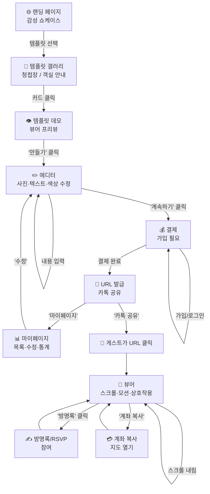

# 03-user-flow.md
## 사용자 플로우

---

## 구매자 플로우 (호스트/신랑신부)

### 플로우 요약
랜딩 → 갤러리 → 템플릿 데모 → 에디터 → 결제(가입) → URL 발급 → 마이페이지

### 상세 단계

#### 1단계: 랜딩 페이지 (S1)
- **액션**: 사용자가 웹사이트 첫 방문
- **화면 구성**:
  - 브랜드 감성 쇼케이스 (타이포, 컬러, 공백)
  - 대표 템플릿 모션 데모 (스크롤 트리거 애니메이션)
  - 큰 CTA 버튼: "템플릿 구경하기"
- **다음 단계**: 템플릿 갤러리로 이동

#### 2단계: 템플릿 갤러리 (S2)
- **액션**: 원하는 버티컬·템플릿 선택
- **화면 구성**:
  - 탭 선택: 청첩장 / 객실 안내서
  - 템플릿 카드 그리드 (이미지 + 카테고리 태그)
  - 호버 시 카드 확대 + 미리보기 모션
- **분기**:
  - 템플릿 카드 클릭 → 템플릿 데모
  - 뒤로 가기 → 랜딩

#### 3단계: 템플릿 데모 (S3)
- **액션**: 선택한 템플릿을 실제 뷰어 그대로 체험
- **화면 구성**:
  - 풀 모바일 뷰어 (최종 산출물과 동일)
  - 스크롤 모션, 마이크로 인터랙션 체험
  - 하단 고정 CTA: "이 템플릿으로 만들기" 버튼
  - 상단: 뒤로 가기 (갤러리로)
- **다음 단계**: 에디터로 이동

#### 4단계: 에디터 (S4)
- **액션**: 템플릿 내용 커스텀 (사진, 텍스트, 색상, 섹션 선택)
- **화면 구성**:
  - 좌측: 입력 폼 (사진 업로드, 텍스트 입력, 색상 선택, 섹션 체크박스)
  - 우측: 실시간 모바일 미리보기 (우상단 종료 버튼)
  - 하단: "계속하기" 버튼 (결제로)
- **자동 저장**:
  - 입력 후 3초 디바운스하여 자동 저장 (매 입력마다 아님)
  - localStorage 및 서버(익명 인증 후) 병렬 저장
  - 네트워크 오류 시에도 로컬 데이터 보존
- **이탈 처리**:
  - 창 닫기 시: "작업이 저장되지 않을 수 있습니다" 경고
  - 나중에 돌아오면: localStorage에서 복구
- **필드별 입력 제외**:
  - 도어락 비번, 계좌번호 → "결제 후 마무리 입력" 단계로 이동
- **다음 단계**: 결제로 이동

#### 5단계: 결제 (S5)
- **액션**: 구매 최종 확인 + 가입/로그인
- **화면 구성**:
  - 주문 요약 (상품명, 가격, 유효기간)
  - 결제 버튼 (토스페이먼츠 모델)
  - "결제하기" 클릭 시:
    1. 이미 로그인? → 즉시 결제 진행
    2. 비로그인? → 가입/로그인 모달 (카카오 원탭 기본, 이메일 폴백)
- **가입 후 처리**:
  - Supabase linkIdentity()로 익명 → 실명 계정 승격
  - 결제 리다이렉트 URL로 이동
  - 주문 DB 저장 (orders 테이블)
- **카카오 인앱 브라우저 복귀 시나리오**:
  - draft 복구 키를 OAuth state 파라미터에 담아 전달
  - 리다이렉트 후 draft 자동 복구
- **실패 처리**:
  - 결제 실패 → 에러 메시지 + 재시도 유도
  - 작업물은 계정에 보존 (재시도 가능)
- **다음 단계**: URL 발급

#### 6단계: URL 발급 & 카톡 공유
- **액션**: 완성된 페이지 URL 획득 및 공유
- **화면 구성**:
  - 성공 메시지 + 발급된 URL 전체 화면 표시
  - 복사 버튼 (클립보드에 복사)
  - "카톡으로 공유하기" 버튼 (카톡 앱 열기)
  - "마이페이지 가기" 버튼
- **OG 태그**: 카톡에서 미리보기 예쁘게 표시
- **다음 단계**: 마이페이지 (또는 카톡으로 공유 완료)

#### 7단계: 마이페이지 (S6)
- **액션**: 구매한 페이지 관리 및 수정
- **화면 구성**:
  - 내가 만든 페이지 목록 (카드 그리드)
  - 각 카드: 썸네일 + 제목 + 상태(활성/만료) + 조회수
  - 카드 클릭 → 상세 보기:
    - 발급 URL 복사
    - 카톡 공유
    - 수정하기 (에디터로 진입)
    - 조회 통계 (시간별 조회수 차트)
    - 유효기간 + 연장 버튼
- **통계 화면**:
  - "총 조회: 123명"
  - "이번 주: 45명" (선택사항)
  - 기간별 그래프 (선택사항)
- **다음 단계**: 수정 (에디터) 또는 공유 계속

---

## 받는 사람 플로우 (게스트/청첩 받는 사람)

### 플로우 요약
URL 클릭 → 뷰어 페이지 로드 → 상호작용 (방명록, RSVP, 지도, 계좌 복사 등)

### 상세 단계

#### 1단계: URL 클릭
- **액션**: 호스트/신랑신부가 보낸 카톡 또는 카카오톡 링크 클릭
- **로드 시점**:
  - Vercel ISR로 정적 HTML 로드
  - OG 미리보기 (카톡에서 썸네일 + 제목 + 설명)
  - LCP < 2초 (성능 목표)
- **다음 단계**: 뷰어 페이지 렌더링

#### 2단계: 뷰어 페이지 (S7) - 청첩장 예시
- **액션**: 모바일에서 페이지를 위아래로 스크롤하며 감상 및 상호작용
- **화면 구성** (섹션 예시):

  1. **히어로 섹션** (맨 위)
     - 배경 이미지 (고정 배경)
     - 신랑·신부 이름 + 결혼식 날짜 (애니메이션 텍스트)
     - 스크롤 시 페이드 아웃

  2. **스토리 섹션**
     - 신랑·신부 사진 (병렬 레이아웃)
     - 소개 텍스트 (스크롤 트리거 슬라이드인)
     - Toss급 부드러운 모션

  3. **오시는 길 섹션**
     - 지도 (클릭 가능, 네이버/카카오 지도 링크)
     - 주소 (터치해서 복사 가능)
     - 교통 정보 (버스, 지하철, 주차)

  4. **축의금 계좌 섹션**
     - 신랑 계좌 (은행, 계좌번호, 예금주)
     - 신부 계좌
     - "복사" 버튼 (한 번 클릭 시 "123-456-789" 자동 복사)
     - 피드백: 복사 완료 토스트 메시지

  5. **참석여부(RSVP) 섹션**
     - 드롭다운: "참석합니다" / "불참합니다"
     - 입력창: 이름, 인원수, 메시지 (선택)
     - 제출 버튼
     - 반응: 제출 시 감사 메시지 표시

  6. **방명록 섹션**
     - 댓글 리스트 (최신 순)
     - 입력 폼: 이름, 메시지
     - "축의말씀 남기기" 버튼
     - 게시 후 바로 댓글 표시
     - 실시간 업데이트 (다른 사람 댓글도 보임)

- **모션 디테일**:
  - 각 섹션이 스크롤로 진입할 때 아래에서 위로 슬라이드
  - 텍스트는 약간 뒤에 페이드인 (캐스케이딩 애니메이션)
  - 터치 피드백: 버튼 누르면 약간 축소 후 복원 (spring 애니메이션)

#### 3단계: 상호작용 (선택적)

**참석여부 제출**
- 이름 + 인원수 + 메시지(옵션) 입력
- "제출" 클릭
- 호스트 DB에 rsvp_responses 저장
- 게스트: 감사 메시지 표시
- 호스트: 마이페이지 통계에서 "RSVP 완료: 5명" 확인 가능 (추후 기능)

**방명록 댓글**
- 이름 + 메시지 입력
- "축의말씀 남기기" 클릭
- guestbook_entries 테이블에 저장
- 즉시 화면에 표시
- 모든 방문자가 댓글 보기 가능

**계좌 복사**
- "복사" 버튼 클릭
- 계좌번호를 클립보드에 복사
- 토스트 메시지: "복사되었습니다"
- 1~2초 후 자동 사라짐

**지도 클릭**
- 주소 또는 지도 클릭
- 네이버 지도 / 카카오 지도 앱 또는 웹 열기
- 길 찾기 화면으로 진입

#### 4단계: 페이지 만료 (1년 후, Grace 기간 포함)
- **사전 알림 (P0로 승격)**:
  - D-30: 이메일 + 알림톡 "30일 후 만료됨"
  - D-7: 이메일 + 알림톡 "7일 후 만료됨"
  - D-1: 이메일 + 알림톡 "내일 만료됨"
- **만료 상태**:
  - 첫 7~30일: read-only grace 기간 (게스트는 페이지 조회 가능, 호스트는 읽기전용)
  - 객실 안내서는 비밀정보 접근 유지 (도어락·와이파이 비번 포함)
  - 청첩장은 계좌, 지도 등 기본 정보만 조회 가능
- **완전 만료 후**:
  - "이 페이지는 2027년 6월 11일에 만료되었습니다"
  - "호스트에게 연장을 요청하세요" (opt-in + 마스킹/인앱 중계 형태)
- **호스트 입장**: 마이페이지에서 "연장하기" 버튼 클릭 → 재결제

---

## 객실 안내서 뷰어 (S7 변형)

비슷한 구조이지만 섹션이 다름:

1. **히어로 섹션**: 숙소명 + 대표 사진
2. **와이파이/도어락 카드**: 초록색 배경, 큰 텍스트, 복사 버튼 (공유 URL의 토큰 검증 후만 표시)
3. **체크인 가이드**: 스텝별 안내 (1. 현관 도착 → 2. 도어락 입력 → 3. 짐 정리)
4. **필수 정보 지도**: 주소, 건물명
5. **호스트 연락 버튼**: "문제가 있으면 여기 클릭" → 인앱 문의 중계 또는 opt-in 마스킹 연락처
6. **오프라인 캐시 (P0로 승격)**: 게스트가 1회 열람 후 로컬 캐시 (오프라인 접근 가능)
7. **조회 통계** (호스트만 마이페이지에서 볼 수 있음): "이 안내서를 본 게스트: 12명"

---

## Mermaid 다이어그램: 전체 사용자 플로우

```mermaid
graph TD
    A["🌐 랜딩 페이지<br/>감성 쇼케이스"]
    B["📱 템플릿 갤러리<br/>청첩장 / 객실 안내"]
    C["👁️ 템플릿 데모<br/>뷰어 프리뷰"]
    D["✏️ 에디터<br/>사진·텍스트·색상 수정"]
    E["💰 결제<br/>가입 필요"]
    F["🔗 URL 발급<br/>카톡 공유"]
    G["📊 마이페이지<br/>목록·수정·통계"]
    
    H["🎉 게스트가 URL 클릭"]
    I["📖 뷰어<br/>스크롤·모션·상호작용"]
    J["✍️ 방명록/RSVP<br/>참여"]
    K["💳 계좌 복사<br/>지도 열기"]
    
    A -->|템플릿 선택| B
    B -->|카드 클릭| C
    C -->|'만들기' 클릭| D
    D -->|내용 입력| D
    D -->|'계속하기' 클릭| E
    E -->|가입/로그인| E
    E -->|결제 완료| F
    F -->|'카톡 공유'| H
    F -->|'마이페이지'| G
    G -->|'수정'| D
    
    H --> I
    I -->|스크롤 내림| I
    I -->|'방명록' 클릭| J
    I -->|'계좌 복사'| K
    J --> I
    K --> I
```

---

## 플로우 전환점 (CTA 버튼)

| 버튼 | 위치 | 다음 화면 | 조건 |
|-----|------|---------|------|
| "템플릿 구경하기" | S1 랜딩 | S2 갤러리 | 항상 |
| 템플릿 카드 | S2 갤러리 | S3 데모 | 항상 |
| "이 템플릿으로 만들기" | S3 데모 | S4 에디터 | 항상 |
| "계속하기" | S4 에디터 | S5 결제 | 필수 입력 완료 |
| "결제하기" | S5 결제 | URL 발급 | 비로그인 시 가입 먼저 |
| "마이페이지 가기" | URL 발급 화면 | S6 마이페이지 | 결제 완료 후 |
| "수정" | S6 마이페이지 카드 | S4 에디터 | 소유자만 |
| "복사" | S7 뷰어 (계좌 섹션) | (클립보드 복사) | 누구나 |
| "축의말씀 남기기" | S7 뷰어 (방명록) | 댓글 추가 | 누구나 |

---

## 엣지 케이스 (Failure States)

| 상황 | 화면 표시 | 사용자 액션 |
|-----|---------|-----------|
| 결제 실패 | "결제에 실패했습니다" + 재시도 버튼 | 다시 결제하기 또는 마이페이지 이동 |
| 만료된 URL | "이 페이지는 만료되었습니다" + 호스트 연락 정보 | 호스트 연락 (선택) |
| 에디터 중 이탈 | 돌아오면 localStorage에서 자동 복구 | 이전 작업 내용 그대로 보임 |
| 조회 통계 0명 | "아직 아무도 보지 않았습니다" + "공유해보세요" 유도 | URL 복사 또는 카톡 공유 |
| 사진 업로드 실패 | "업로드에 실패했습니다" + 재시도 안내 | 다시 선택 |
| 네트워크 끊김 | 에디터: 로컬 임시저장 유지 | 네트워크 복구 후 계속 |

---

## Loop Metadata

- **Upstream documents referenced**: 01-prd.md, 06-screens.md
- **Downstream documents affected**: 04-database-schema.md, 07-coding-convention.md
- **Open questions**:
  - 방명록과 RSVP를 섹션별로 on-off 가능하게 할까?
  - 게스트가 댓글을 수정/삭제할 수 있을까?
  - 호스트가 댓글을 승인해야 표시할까? (모더레이션)
- **Assumptions**:
  - 게스트는 이름과 메시지만 입력해서 댓글/RSVP 가능 (로그인 불필요)
  - URL은 공개 (누구나 접근 가능)
  - 호스트 수정 중에는 게스트 조회 가능 (실시간 반영)
  - 카카오 인앱 리다이렉트 시 draft 복구 키는 state 파라미터로 운반 가능
- **Validation criteria**:
  - 실제 사용자가 전체 플로우 완주 (부업 호스트 지현 + 예비부부 수진·민준)
  - 각 버튼 클릭 시 다음 화면으로 올바르게 이동
  - 에디터 자동저장(3초 디바운스) 검증
  - 결제 모크 리다이렉트 왕복 + URL 발급 확인
  - 만료 grace 기간 동작 검증
- **Last reviewed**: council 리뷰 반영(2026-06-11)
