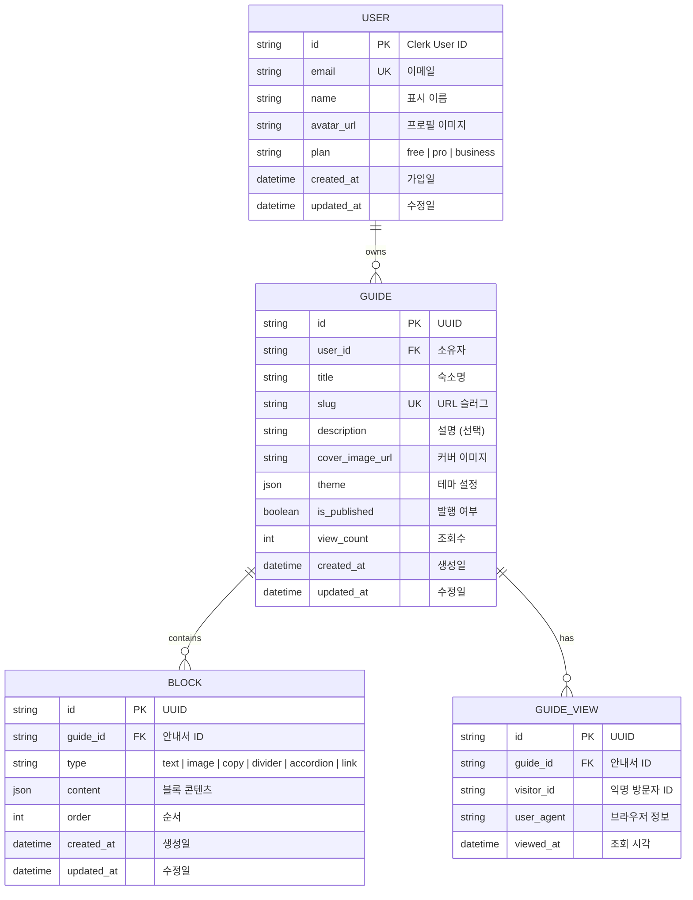
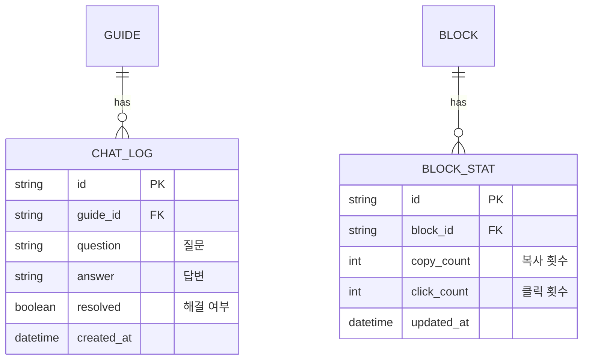

# Database Design (데이터베이스 설계)

> Roomy - 에어비앤비 호스트를 위한 디지털 숙소 안내서 플랫폼

---

## MVP 캡슐

| # | 항목 | 내용 |
|---|------|------|
| 1 | 목표 | 에어비앤비 호스트가 디지털 안내서를 만들고 공유 |
| 2 | 페르소나 | 부업 호스트 **[가설]** |
| 3 | 핵심 기능 | FEAT-1: 안내서 생성 및 발행 |
| 4 | 성공 지표 (노스스타) | MRR ₩100만 |
| 5 | 입력 지표 | 발행된 안내서 수, 조회수 |
| 6 | 비기능 요구 | 게스트 뷰 < 2초 |
| 7 | Out-of-scope | AI 챗봇 |
| 8 | Top 리스크 | 타겟 미검증 |
| 9 | 완화/실험 | 사용자 조사 먼저 |
| 10 | 다음 단계 | 호스트 인터뷰 |

---

## 1. ERD (Entity Relationship Diagram)



---

## 2. 엔티티 상세 정의

### 2.1 USER (사용자) - FEAT-0

> **Note**: 인증은 Clerk에서 관리. 이 테이블은 추가 사용자 정보 저장용.

| 컬럼 | 타입 | 제약조건 | 설명 |
|------|------|----------|------|
| id | VARCHAR(255) | PK | Clerk User ID |
| email | VARCHAR(255) | UNIQUE, NOT NULL | 이메일 |
| name | VARCHAR(100) | NULL | 표시 이름 |
| avatar_url | VARCHAR(500) | NULL | 프로필 이미지 URL |
| plan | VARCHAR(20) | NOT NULL, DEFAULT 'free' | 구독 플랜 |
| created_at | TIMESTAMP | NOT NULL, DEFAULT NOW() | 가입일 |
| updated_at | TIMESTAMP | NOT NULL | 수정일 |

**인덱스:**
- `idx_user_email` ON email

**최소 수집 원칙:**
- 필수: email (Clerk에서 가져옴)
- 선택: name, avatar_url
- 수집 안 함: 전화번호, 주소, 생년월일

### 2.2 GUIDE (안내서) - FEAT-1

| 컬럼 | 타입 | 제약조건 | 설명 |
|------|------|----------|------|
| id | UUID | PK, DEFAULT uuid_generate_v4() | 고유 ID |
| user_id | VARCHAR(255) | FK → USER.id, NOT NULL | 소유자 |
| title | VARCHAR(200) | NOT NULL | 숙소명 |
| slug | VARCHAR(100) | UNIQUE, NOT NULL | URL 슬러그 |
| description | TEXT | NULL | 숙소 설명 |
| cover_image_url | VARCHAR(500) | NULL | 커버 이미지 |
| theme | JSONB | DEFAULT '{}' | 테마 설정 |
| is_published | BOOLEAN | NOT NULL, DEFAULT false | 발행 여부 |
| view_count | INTEGER | NOT NULL, DEFAULT 0 | 조회수 |
| created_at | TIMESTAMP | NOT NULL, DEFAULT NOW() | 생성일 |
| updated_at | TIMESTAMP | NOT NULL | 수정일 |

**인덱스:**
- `idx_guide_user_id` ON user_id
- `idx_guide_slug` ON slug
- `idx_guide_is_published` ON is_published
- `idx_guide_created_at` ON created_at DESC

**Theme JSON 구조:**
```typescript
interface GuideTheme {
  primaryColor?: string;  // "#E07A5F"
  fontFamily?: string;    // "pretendard"
  // Phase 2에서 확장
}
```

### 2.3 BLOCK (블록) - FEAT-1

| 컬럼 | 타입 | 제약조건 | 설명 |
|------|------|----------|------|
| id | UUID | PK, DEFAULT uuid_generate_v4() | 고유 ID |
| guide_id | UUID | FK → GUIDE.id, NOT NULL | 안내서 ID |
| type | VARCHAR(20) | NOT NULL | 블록 타입 |
| content | JSONB | NOT NULL | 블록 콘텐츠 |
| order | INTEGER | NOT NULL | 표시 순서 |
| created_at | TIMESTAMP | NOT NULL, DEFAULT NOW() | 생성일 |
| updated_at | TIMESTAMP | NOT NULL | 수정일 |

**인덱스:**
- `idx_block_guide_id` ON guide_id
- `idx_block_order` ON (guide_id, order)

**Block Type Enum:**
```typescript
type BlockType =
  | 'text'      // 텍스트 블록
  | 'image'     // 이미지 블록
  | 'copy'      // 복사 블록 (와이파이 비번 등)
  | 'divider'   // 구분선
  | 'accordion' // 아코디언 (Phase 2)
  | 'link';     // 링크 (Phase 2)
```

**Content JSON 구조:**

```typescript
// 텍스트 블록
interface TextBlockContent {
  variant: 'heading' | 'subheading' | 'body';
  text: string;
}

// 이미지 블록
interface ImageBlockContent {
  url: string;
  alt: string;
  caption?: string;
}

// 복사 블록
interface CopyBlockContent {
  label: string;       // "와이파이 비밀번호"
  value: string;       // "ocean2024!"
  icon?: 'wifi' | 'key' | 'location' | 'custom';
}

// 구분선 블록
interface DividerBlockContent {
  style?: 'solid' | 'dashed' | 'dotted';
}

// 아코디언 블록 (Phase 2)
interface AccordionBlockContent {
  title: string;       // "Q. 체크아웃 시간이 언제인가요?"
  content: string;     // "체크아웃은 오전 11시입니다."
}

// 링크 블록 (Phase 2)
interface LinkBlockContent {
  label: string;       // "주변 맛집 보기"
  url: string;         // "https://..."
  icon?: 'external' | 'map' | 'phone';
}
```

### 2.4 GUIDE_VIEW (조회 기록) - Phase 2

| 컬럼 | 타입 | 제약조건 | 설명 |
|------|------|----------|------|
| id | UUID | PK | 고유 ID |
| guide_id | UUID | FK → GUIDE.id, NOT NULL | 안내서 ID |
| visitor_id | VARCHAR(100) | NOT NULL | 익명 방문자 ID (fingerprint) |
| user_agent | VARCHAR(500) | NULL | 브라우저 정보 |
| viewed_at | TIMESTAMP | NOT NULL, DEFAULT NOW() | 조회 시각 |

**인덱스:**
- `idx_guide_view_guide_id` ON guide_id
- `idx_guide_view_viewed_at` ON viewed_at DESC

---

## 3. 관계 정의

| 부모 | 자식 | 관계 | ON DELETE |
|------|------|------|-----------|
| USER | GUIDE | 1:N | CASCADE |
| GUIDE | BLOCK | 1:N | CASCADE |
| GUIDE | GUIDE_VIEW | 1:N | CASCADE |

---

## 4. 데이터 생명주기

| 엔티티 | 생성 시점 | 보존 기간 | 삭제/익명화 |
|--------|----------|----------|------------|
| USER | Clerk 인증 후 | 탈퇴 후 30일 | Hard delete |
| GUIDE | 안내서 생성 | 사용자와 동일 | Cascade delete |
| BLOCK | 블록 추가 | 안내서와 동일 | Cascade delete |
| GUIDE_VIEW | 페이지 조회 | 1년 | 익명화 후 집계 |

---

## 5. Prisma Schema

```prisma
// prisma/schema.prisma

generator client {
  provider = "prisma-client-js"
}

datasource db {
  provider = "postgresql"
  url      = env("DATABASE_URL")
}

model User {
  id         String   @id // Clerk User ID
  email      String   @unique
  name       String?
  avatarUrl  String?  @map("avatar_url")
  plan       String   @default("free")
  createdAt  DateTime @default(now()) @map("created_at")
  updatedAt  DateTime @updatedAt @map("updated_at")

  guides     Guide[]

  @@map("users")
}

model Guide {
  id            String   @id @default(uuid())
  userId        String   @map("user_id")
  title         String
  slug          String   @unique
  description   String?
  coverImageUrl String?  @map("cover_image_url")
  theme         Json     @default("{}")
  isPublished   Boolean  @default(false) @map("is_published")
  viewCount     Int      @default(0) @map("view_count")
  createdAt     DateTime @default(now()) @map("created_at")
  updatedAt     DateTime @updatedAt @map("updated_at")

  user          User     @relation(fields: [userId], references: [id], onDelete: Cascade)
  blocks        Block[]
  views         GuideView[]

  @@index([userId])
  @@index([slug])
  @@index([isPublished])
  @@map("guides")
}

model Block {
  id        String   @id @default(uuid())
  guideId   String   @map("guide_id")
  type      String
  content   Json
  order     Int
  createdAt DateTime @default(now()) @map("created_at")
  updatedAt DateTime @updatedAt @map("updated_at")

  guide     Guide    @relation(fields: [guideId], references: [id], onDelete: Cascade)

  @@index([guideId])
  @@index([guideId, order])
  @@map("blocks")
}

model GuideView {
  id        String   @id @default(uuid())
  guideId   String   @map("guide_id")
  visitorId String   @map("visitor_id")
  userAgent String?  @map("user_agent")
  viewedAt  DateTime @default(now()) @map("viewed_at")

  guide     Guide    @relation(fields: [guideId], references: [id], onDelete: Cascade)

  @@index([guideId])
  @@index([viewedAt])
  @@map("guide_views")
}
```

---

## 6. 확장 고려사항

### 6.1 Phase 2에서 추가 예정



### 6.2 인덱스 전략

- **읽기 최적화**: slug 조회 (게스트 뷰), user_id 조회 (대시보드)
- **쓰기 고려**: 블록 순서 변경 시 order 업데이트
- **집계**: view_count는 주기적 배치로 업데이트 (실시간 X)

### 6.3 성능 최적화

| 시나리오 | 최적화 방법 |
|---------|------------|
| 안내서 목록 조회 | user_id 인덱스 + 페이지네이션 |
| 게스트 뷰 조회 | slug 인덱스 + 캐싱 (CDN) |
| 블록 순서 변경 | 트랜잭션으로 묶어서 처리 |
| 조회수 증가 | view_count는 비동기 업데이트 |

---

## Decision Log

| 날짜 | 결정 | 이유 |
|------|------|------|
| 2026-01-19 | Clerk User ID 사용 | 인증은 Clerk 위임 |
| 2026-01-19 | JSONB for content | 블록 타입별 유연한 스키마 |
| 2026-01-19 | view_count 비동기 | 성능 최적화 |
