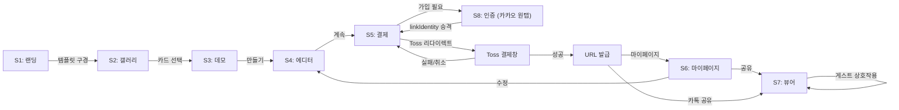

# 06-screens.md
## 화면 정의 (Screen Specs)

### 개요
8개 화면 정의: 랜딩, 갤러리, 데모, 에디터, 결제, 마이페이지, 뷰어, 인증

---

## S1: 랜딩 페이지

### 목적
브랜드 감성을 소개하고, 사용자를 템플릿 갤러리로 유도.

### 핵심 컴포넌트

```
┌─────────────────────────────────┐
│  Roomy (로고)                    │  ← 헤더 (고정)
├─────────────────────────────────┤
│                                 │
│   신랑신부를 위한              │
│   감성 모바일 페이지            │  ← 히어로 텍스트 (스크롤 페이드아웃)
│                                 │
│   [템플릿 구경하기]            │  ← CTA 버튼 (Primary)
│                                 │
├─────────────────────────────────┤
│ 🎨 감성 있는 템플릿             │
│ 수백 명이 이미 사용했어요        │  ← 신뢰도 섹션
├─────────────────────────────────┤
│ 💨 5분 안에 만들기              │
│ 복잡한 설정은 필요 없어요        │  ← 특징 섹션 (3개 아이콘)
├─────────────────────────────────┤
│ 📱 모바일 최적화                 │
│ 받는 사람은 아름다운 페이지만 봐요│
├─────────────────────────────────┤
│  [카톡으로 공유하기]            │  ← 보조 CTA
│                                 │
│  Roomy © 2026                   │  ← 푸터
└─────────────────────────────────┘
```

### 상태

- **로딩**: 히어로 이미지 로드 중 스켈레톤
- **빈 상태**: N/A (항상 콘텐츠 있음)
- **오류**: N/A (정적 페이지)

### 이동 경로
- "템플릿 구경하기" → S2 갤러리
- 로고 클릭 → 페이지 새로고침

### UI 요소 세부사항

| 요소 | 스타일 | 특성 |
|-----|--------|------|
| 헤더 | 흰색 배경, 고정 위치 | 스크롤 시 그림자 추가 |
| 히어로 텍스트 | Noto Serif KR 900, 48px | 스크롤 트리거 페이드아웃 |
| CTA 버튼 | Primary 색상, 60px 높이 | tap animation (scale 0.95) |
| 섹션 제목 | Noto Serif KR 700, 32px | 스크롤 슬라이드인 |
| 섹션 본문 | Pretendard 400, 16px | 섹션과 약간 뒤에 페이드인 |

---

## S2: 템플릿 갤러리

### 목적
사용자가 원하는 버티컬(청첩장/객실 안내)과 감성 있는 템플릿을 선택.

### 핵심 컴포넌트

```
┌─────────────────────────────────┐
│  < 랜딩  Roomy  [☰]             │  ← 헤더 (뒤로/로고/메뉴)
├─────────────────────────────────┤
│  [ 청첩장 ]  [ 객실 안내 ]     │  ← 탭 (인디케이터)
├─────────────────────────────────┤
│                                 │
│  ┌─────────────┐ ┌─────────────┐│
│  │   Template  │ │   Template  ││
│  │   이미지    │ │   이미지    ││
│  ├─────────────┤ ├─────────────┤│
│  │ 모던 청첩   │ │ 미니멀 청첩 ││  ← 카드 그리드 (2열)
│  │ #modern     │ │ #minimal    ││
│  │ [보기]      │ │ [보기]      ││
│  └─────────────┘ └─────────────┘│
│                                 │
│  ┌─────────────┐ ┌─────────────┐│
│  │   Template  │ │   Template  ││
│  └─────────────┘ └─────────────┘│
│                                 │
└─────────────────────────────────┘
```

### 상태

**정상 상태**
- 탭: 청첩장 / 객실 안내 (토글)
- 카드: 호버 시 그림자 확대, 스케일 1.05로 확대

**로딩 상태**
- 카드 자리에 스켈레톤 (높이 200px)
- "템플릿 불러오는 중..." 텍스트

**빈 상태**
- "아직 템플릿이 없습니다"
- 재시도 버튼

**오류 상태**
- "템플릿을 불러올 수 없습니다"
- 재시도 버튼

### 이동 경로
- 카드 클릭 → S3 데모 (template_id 전달)
- "뒤로" → S1 랜딩
- 탭 전환 → 같은 페이지 (vertical 필터)

### API 연결

```typescript
// GET /api/templates?vertical=wedding&vertical=guidebook
// 응답:
{
  templates: [
    {
      id: "uuid-1",
      title: "모던 청첩",
      vertical: "wedding",
      thumbnail_url: "s3://...",
      preview_url: "s3://..."
    }
  ]
}
```

### 성능

- 템플릿 갤러리 조회: < 200ms
- 이미지 로드: WebP 포맷, 원본 크기 작게 (< 100KB)

---

## S3: 템플릿 데모

### 목적
선택한 템플릿을 최종 형태(뷰어)와 동일하게 경험. "이 템플릿으로 만들기" CTA.

### 핵심 컴포넌트

```
┌─────────────────────────────────┐
│  < 갤러리  X                     │  ← 헤더 (뒤로/닫기)
├─────────────────────────────────┤
│                                 │
│   (뷰어 페이지와 동일)           │  ← S7 뷰어 프리뷰
│                                 │
│   [이 템플릿으로 만들기]        │  ← CTA (고정 하단)
│                                 │
└─────────────────────────────────┘
```

### 상태

- **로딩**: 뷰어 콘텐츠 로드 중 스켈레톤
- **완료**: 뷰어 전체 표시
- **오류**: "템플릿을 불러올 수 없습니다" + 갤러리로 돌아가기

### 이동 경로
- "이 템플릿으로 만들기" → S4 에디터 (template_id 전달)
- "뒤로" 또는 "닫기" → S2 갤러리

### 상호작용

- 스크롤: 뷰어처럼 자유 스크롤
- 방명록/RSVP 입력: 비활성화 (미리보기만)
- 계좌 복사: 모크 (실제로는 복사 안 함)

---

## S4: 에디터

### 목적
템플릿 내용을 커스터마이즈 (사진, 텍스트, 색상, 섹션 선택).

### 핵심 컴포넌트 (데스크톱 1024px+)

```
┌────────────────────────────────────────────────┐
│  ← 갤러리  Roomy  저장됨 ✓                      │  ← 헤더
├──────────────────────┬──────────────────────────┤
│                      │                          │
│  입력 폼             │  모바일 미리보기 (우측) │
│  ──────────          │  ──────────────          │
│                      │                          │
│  제목 입력           │  ┌──────────────────┐   │
│  ┌──────────────┐   │  │  신랑·신부        │   │
│  │ 김수진 · 박민준│   │  │  (실시간 갱신)   │   │
│  └──────────────┘   │  │                  │   │
│                      │  │  [스크롤 가능]   │   │
│  대표 사진 업로드    │  │                  │   │
│  ┌──────────────┐   │  │  오시는 길        │   │
│  │ [사진 선택]  │   │  │  ────────        │   │
│  └──────────────┘   │  │                  │   │
│                      │  │  축의금 계좌      │   │
│  주 색상             │  │  ────────        │   │
│  ⭕ #E03131         │  │                  │   │
│  [더 보기]           │  │  방명록           │   │
│                      │  │  ────────        │   │
│  섹션 선택           │  │                  │   │
│  ☑️ 히어로           │  │                  │   │
│  ☑️ 오시는 길       │  │                  │   │
│  ☑️ 축의금 계좌     │  │                  │   │
│  ☑️ 방명록          │  │                  │   │
│  ☐ RSVP (참석여부)  │  │  [X 닫기]        │   │
│                      │  └──────────────────┘   │
├──────────────────────┴──────────────────────────┤
│  [초안 저장]  [계속하기]                        │  ← 하단 버튼
└──────────────────────────────────────────────────┘
```

### 모바일 레이아웃 (320~480px)

```
┌─────────────────────────────┐
│  ← Roomy  저장됨 ✓          │  ← 헤더
├─────────────────────────────┤
│                             │
│  입력 폼 (단일 패널)        │
│  ─────────────             │
│  제목 입력                 │
│  대표 사진 업로드          │
│  주 색상 선택              │
│  섹션 토글                 │
│                             │
├─────────────────────────────┤
│  [미리보기] (풀스크린 오버레이) │  ← 하단 고정
│                             │
│  오버레이 내용:             │
│  ┌─────────────────────────┐│
│  │ [X 닫기]                 ││
│  │ (미리보기 내용)         ││
│  │ (마지막 편집 필드로     ││
│  │  닫기 시 복귀)          ││
│  └─────────────────────────┘│
├─────────────────────────────┤
│  [초안 저장]  [계속하기]    │  ← 하단 버튼
└─────────────────────────────┘
```

### 상태

**정상 상태**
- 입력 가능, 우측 미리보기 실시간 갱신
- "저장됨 ✓" 표시 (자동 임시저장)

**로딩 상태**
- 사진 업로드 중: 프로그레스 바 (20~100%)
- 서버 저장 중: "저장 중..." + 로딩 스피너

**오류 상태**
- 사진 업로드 실패: "업로드 실패. 재시도하세요" + 재시도 버튼
- 네트워크 끊김: "오프라인 상태입니다. 로컬에 저장됩니다" (localStorage)

**빈 상태**
- N/A (항상 기본 템플릿 콘텐츠로 시작)

### 입력 폼 항목 (버티컬별)

**청첩장 (Wedding)**
1. 신랑 이름 (필수)
2. 신부 이름 (필수)
3. 결혼식 날짜 (필수)
4. 대표 사진 (필수)
5. 신랑 계좌 (필수)
6. 신부 계좌 (필수)
7. 주소 (필수)
8. 위도·경도 (자동, 주소 입력 시)
9. 주 색상 (선택)
10. 섹션 on-off (포토 갤러리, 방명록, RSVP, 축의금 계좌, 오시는길)

**객실 안내 (Guidebook)**
1. 숙소명 (필수)
2. 와이파이 이름 (필수)
3. 와이파이 비번 → **"결제 후 마무리 입력"으로 이동**
4. 도어락 비번 → **"결제 후 마무리 입력"으로 이동**
5. 체크인 가이드 (필수 텍스트)
6. 대표 사진 (필수)
7. 주소 (필수)
8. 호스트 연락처 → **opt-in + 마스킹/인앱 중계 (선택사항으로 강등)**
9. 섹션 on-off (규칙, 공지사항 등)

### 미리보기

- 우측 패널: 모바일 폭 (375px) 고정
- 스크롤 연동: 우측 스크롤 따라감
- 실시간: 입력 필드 변경 시 즉시 반영 (1~2프레임 지연)

### 이동 경로
- "계속하기" → S5 결제
- "뒤로" → S2 갤러리 (임시저장 유지, 경고 없음)
- "초안 저장" → 현재 상태 localStorage 업데이트

### localStorage 구조 (base64 금지 명문화)

```json
{
  "draft_wedding_uuid-123": {
    "template_id": "uuid-1",
    "user_id": "anon_uuid_from_signInAnonymously",
    "content": {
      "sections": [
        {
          "id": "hero",
          "title": "김수진 · 박민준",
          "image_url": "s3://roomy-storage/anon_uuid/page-uuid/hero.jpg",
          "visible": true
        }
      ],
      "colors": { "primary": "#E03131" }
    },
    "updated_at": 1718028000000
  }
}
```

**금지**: `image: "data:image/jpeg;base64,..."` (보안 위험, 크기 초과)

### 성능

- 미리보기 갱신: < 100ms
- 사진 클라이언트 리사이즈: < 500ms (1MB → 100KB)
- 자동 임시저장: **입력 후 3초 디바운스** (매 입력마다 아님)

---

## S5: 결제

### 목적
주문 요약 후 결제 진행. 비로그인 사용자는 가입 필요 (카카오 원탭 기본).

### 핵심 컴포넌트

```
┌─────────────────────────────────┐
│  Roomy  X                        │  ← 헤더
├─────────────────────────────────┤
│                                 │
│  주문 요약                       │
│  ─────────────                   │
│                                 │
│  상품명: 모던 청첩장            │
│  가격: ₩29,900                  │
│  유효기간: 1년 (2027년 6월 11일)│
│                                 │
│  [ 결제하기 ]                   │  ← CTA 버튼 (Primary, #E03131)
│                                 │
└─────────────────────────────────┘
```

### 상태

**비로그인 상태**
- "결제하기" 클릭 시 → S8 인증 (카카오 원탭 기본, 이메일 폴백) 모달
- 가입 완료 후 → Supabase linkIdentity()로 승격 → 결제 진행 (리다이렉트)
- 카카오 인앱 리다이렉트 시 draft 복구 키를 state 파라미터로 운반

**로딩 상태**
- "결제 중..." + 스피너
- 버튼 비활성화

**리다이렉트 상태 (Toss 모델)**
- "결제하기" 클릭 → Toss 결제창 리다이렉트
- 성공: successUrl로 리다이렉트 → URL 발급
- 실패/취소: failUrl로 리다이렉트 → 결제 화면 복귀

**오류 상태**
- 결제 실패: "결제에 실패했습니다" + 오류 코드 + 재시도
- 네트워크 오류: "연결을 확인하세요" + 재시도

### 이동 경로
- "결제하기" → S8 인증 (비로그인) 또는 Toss 리다이렉트 (로그인)
- "X" 또는 "뒤로" → S4 에디터 (결제 취소, 작업물 보존)
- 결제 성공 → successUrl → URL 발급 페이지

### API 연결 (Toss 실모델)

```typescript
// POST /api/orders (서버가 금액 결정, 클라이언트 전송 금지!)
// 요청:
{
  page_id: "uuid-1"
  // amount 전송 금지 ❌
}

// 응답:
{
  orderId: "order_uuid",
  amount: 29900,
  paymentUrl: "https://toss-payment.url?orderId=...",
  successUrl: "/page/{slug}?status=success",
  failUrl: "/checkout?status=failed"
}

// 결제 후 confirmPayment (웹훅 또는 클라이언트)
// POST /api/orders/confirm
{
  paymentKey: "toss_paymentKey",
  orderId: "order_uuid",
  amount: 29900
}
```

---

## S6: 마이페이지

### 목적
로그인 사용자의 구매 페이지 목록 관리, 수정, 공유, 통계 조회.

### 핵심 컴포넌트

```
┌─────────────────────────────────┐
│  ← 다시 만들기  마이페이지  [☰]  │  ← 헤더
├─────────────────────────────────┤
│                                 │
│  프로필                          │
│  ─────────────                   │
│  [프로필 이미지]                │
│  김수진                          │
│  khy@roomy.app                  │
│  [수정]                          │
│                                 │
├─────────────────────────────────┤
│                                 │
│  내 페이지                       │
│  ─────────────                   │
│                                 │
│  ┌──────────────────────────┐   │
│  │ [썸네일]                 │   │
│  │ 신랑신부 청첩장         │   │
│  │ 👁️ 조회 23 | 📅 2026.06 │   │
│  │                          │   │
│  │ [수정] [공유] [삭제]    │   │
│  └──────────────────────────┘   │
│                                 │
│  ┌──────────────────────────┐   │
│  │ [썸네일]                 │   │
│  │ 501호 객실 가이드       │   │
│  │ 👁️ 조회 156 | 📅 2026.05│   │
│  │ ⚠️ 2026.06.11 만료 예정 │   │
│  │                          │   │
│  │ [수정] [공유] [삭제]    │   │
│  └──────────────────────────┘   │
│                                 │
│  [+ 새 페이지 만들기]           │
│                                 │
└─────────────────────────────────┘
```

### 상태

**정상 상태**
- 페이지 목록 표시
- 각 카드: 썸네일 + 제목 + 상태 + 액션 버튼

**빈 상태**
- "아직 페이지가 없습니다"
- "지금 만들어보세요" CTA

**로딩 상태**
- 페이지 목록 스켈레톤 (4개)

**만료 알림**
- 카드 우하단에 ⚠️ 아이콘
- "YYYY.MM.DD 만료 예정"

### 페이지 카드 상세

클릭 시 상세 모달:

```
┌─────────────────────────────────┐
│ 신랑신부 청첩장                 │
│ ─────────────────────────────── │
│                                 │
│ 발급된 URL:                      │
│ https://roomy.app/page/khy-...  │
│ [복사]                           │
│                                 │
│ 조회 통계:                       │
│ 총 23명이 봤습니다             │
│ (오늘 5명, 이번 주 12명)       │
│                                 │
│ 유효 기간:                       │
│ 2026.06.11 만료                │
│ [연장하기]                       │
│                                 │
│ [수정]  [카톡 공유]  [삭제]    │
│                                 │
└─────────────────────────────────┘
```

### 이동 경로
- 카드 클릭 → 상세 모달
- "[수정]" → S4 에디터 (page_id 전달)
- "[카톡 공유]" → 카톡 앱 열기 (URL 포함)
- "[삭제]" → 확인 모달 → soft delete (복구 가능)
- "[+ 새 페이지 만들기]" → S2 갤러리

### API 연결

```typescript
// GET /api/me/pages
// 응답:
{
  pages: [
    {
      id: "uuid-1",
      title: "신랑신부 청첩장",
      template_id: "uuid-template",
      published_url_slug: "khy-wedding-2026",
      view_count: 23,
      published_at: "2026-06-11T00:00:00Z",
      expires_at: "2027-06-11T00:00:00Z",
      is_renewed: false
    }
  ]
}
```

---

## S7: 뷰어 페이지

### 목적
최종 산출물. 게스트가 실제로 보는 페이지. 아름다운 디자인 + 상호작용.

### 구조 (청첩장 예시)

```
┌─────────────────────────────────┐
│                                 │
│  [히어로 섹션]                  │
│  배경 이미지                     │
│  신랑·신부                       │
│  결혼식 날짜·시간               │  ← 고정 배경, 스크롤 페이드아웃
│                                 │
├─────────────────────────────────┤
│                                 │
│  [스토리 섹션]                  │
│  신랑·신부 소개                 │
│  결혼에 대한 한마디             │  ← 스크롤 슬라이드인
│                                 │
├─────────────────────────────────┤
│                                 │
│  [오시는 길 섹션]               │
│  서울시 강남구 테헤란로 123    │
│  [지도 열기]                    │  ← 클릭 시 네이버/카카오 지도
│  대중교통: 강남역 2번 출구      │
│  주차: 무료 주차 가능           │
│                                 │
├─────────────────────────────────┤
│                                 │
│  [축의금 계좌 섹션]             │
│  신랑 | 국민은행 123-456-789   │
│  [복사]                          │  ← 계좌번호 클립보드 복사
│  신부 | 우리은행 987-654-321   │
│  [복사]                          │
│                                 │
├─────────────────────────────────┤
│                                 │
│  [참석여부 섹션]                │
│  ┌────────────────────────────┐ │
│  │ ○ 참석합니다              │ │  ← 라디오 버튼
│  │ ○ 불참합니다              │ │
│  │                            │ │
│  │ 이름: [입력]              │ │
│  │ 인원: [드롭다운]           │ │
│  │ 메시지: [입력]             │ │
│  │                            │ │
│  │ [제출]                     │ │
│  └────────────────────────────┘ │
│                                 │
├─────────────────────────────────┤
│                                 │
│  [방명록 섹션]                  │
│  ┌────────────────────────────┐ │
│  │ 축의말씀 남기기            │ │
│  │ 이름: [입력]              │ │
│  │ 메시지: [입력]             │ │
│  │ [남기기]                   │ │
│  └────────────────────────────┘ │
│                                 │
│  댓글 (최신 순)                  │
│  ─────────────                   │
│  김철수: 축하합니다! (2시간 전) │
│  박영희: 정말 예뻐요! (1일 전)  │
│  이순신: 참석할게요! (3일 전)   │
│                                 │
│  [더 보기]                       │  ← 무한 스크롤
│                                 │
└─────────────────────────────────┘
```

### 상태

**정상 상태**
- 모든 섹션 표시
- 상호작용 활성화 (방명록, RSVP, 계좌 복사, 지도)

**로딩 상태**
- 첫 로드: 스켈레톤 (섹션별)
- 방명록 추가 로딩: 스피너 (댓글 영역)

**빈 상태**
- 방명록 댓글 0개: "아직 축의말씀이 없습니다"
- RSVP 입력 전: "참석 의사를 알려주세요"

**오류 상태**
- 댓글 제출 실패: "댓글 작성에 실패했습니다" + 재시도
- 네트워크 오류: 오프라인 안내 (선택사항)

**만료 상태 (Grace 기간 7~30일)**
- URL 접근 가능 (read-only)
- "이 페이지는 2027년 6월 11일에 만료되었습니다"
- 청첩장: 기본 정보만 조회 (계좌, 지도 등)
- 객실 안내서: 도어락·와이파이 비번 포함 전체 정보 조회 가능 (체크인 필수)
- "호스트에게 연장을 요청하세요" (opt-in + 마스킹/인앱 중계, 상시 노출 금지)

### 모션

- 각 섹션 진입 시 아래에서 위로 슬라이드 (100ms 간격)
- 텍스트는 섹션 이후 20ms 뒤에 페이드인
- 버튼 클릭: scale 0.95 → 1 (100ms)
- 계좌 복사: 클립보드 복사 후 토스트 "복사되었습니다"

### 이동 경로
- "지도 열기" → 네이버 지도 / 카카오 지도 (주소 기반)
- "복사" → 클립보드 복사 (계좌번호)
- 방명록/RSVP 제출 → 즉시 목록 갱신

### API 연결

```typescript
// GET /page/[slug] (공개, 누구나 접근 가능)
// 응답:
{
  page: {
    id: "uuid-1",
    title: "신랑신부 청첩장",
    content: { sections: [...] },
    published_at: "2026-06-11T00:00:00Z",
    expires_at: "2027-06-11T00:00:00Z"
  }
}

// POST /api/guestbook (댓글 추가, 로그인 불필요)
// 요청:
{
  page_id: "uuid-1",
  visitor_name: "김철수",
  message: "축하합니다!"
}

// POST /api/rsvp (RSVP 제출)
// 요청:
{
  page_id: "uuid-1",
  visitor_name: "박영희",
  attendance: "attending",
  num_guests: 2,
  message: "참석하겠습니다"
}

// POST /page/[slug]/view (조회 통계)
// 요청: 비어있음 (자동 트래킹)
```

### 성능

- LCP: < 2초 (ISR 정적 페이지)
- FCP: < 1초
- 이미지: WebP, 최적화 크기
- 모션: 60fps 유지

---

## S8: 인증 (가입/로그인)

### 목적
결제 시점에 사용자 계정 생성 또는 기존 계정으로 로그인.

### 핵심 컴포넌트 (결제 시점 모달)

```
┌─────────────────────────────────┐
│          X                       │  ← 닫기 (뒤로)
├─────────────────────────────────┤
│                                 │
│  계정이 필요합니다              │
│  ─────────────────────          │
│                                 │
│  이메일 또는 카카오로           │
│  로그인하세요                   │
│                                 │
│  ┌─────────────────────┐       │
│  │ [이메일 가입/로그인]│       │  ← 이메일 선택 시 폼 표시
│  └─────────────────────┘       │
│                                 │
│  ┌─────────────────────┐       │
│  │ [카카오 로그인]     │       │  ← OAuth
│  └─────────────────────┘       │
│                                 │
│  또는 이미 가입되어 있나요?    │
│  [이메일 로그인]               │
│                                 │
└─────────────────────────────────┘
```

### 이메일 가입 폼

```
┌─────────────────────────────────┐
│          X                       │
├─────────────────────────────────┤
│                                 │
│  이메일 가입                     │
│  ─────────────                   │
│                                 │
│  이메일:                         │
│  ┌──────────────────────────┐   │
│  │ example@roomy.app        │   │
│  └──────────────────────────┘   │
│                                 │
│  비밀번호:                       │
│  ┌──────────────────────────┐   │
│  │ ••••••••                 │   │
│  └──────────────────────────┘   │
│                                 │
│  비밀번호 재입력:                │
│  ┌──────────────────────────┐   │
│  │ ••••••••                 │   │
│  └──────────────────────────┘   │
│                                 │
│  □ 약관에 동의합니다            │  ← 체크박스
│                                 │
│  [가입]                          │  ← CTA
│                                 │
│  이미 계정이 있나요?            │
│  [로그인하기]                   │
│                                 │
└─────────────────────────────────┘
```

### 이메일 로그인 폼

```
┌─────────────────────────────────┐
│          X                       │
├─────────────────────────────────┤
│                                 │
│  이메일 로그인                   │
│  ─────────────                   │
│                                 │
│  이메일:                         │
│  ┌──────────────────────────┐   │
│  │ example@roomy.app        │   │
│  └──────────────────────────┘   │
│                                 │
│  비밀번호:                       │
│  ┌──────────────────────────┐   │
│  │ ••••••••                 │   │
│  └──────────────────────────┘   │
│                                 │
│  [로그인]                        │  ← CTA
│                                 │
│  [비밀번호 잊음]                │
│                                 │
│  아직 계정이 없나요?             │
│  [가입하기]                      │
│                                 │
└─────────────────────────────────┘
```

### 상태

**로딩**
- 이메일 검증 중: "확인 중..."
- 로그인 진행 중: 버튼 비활성화 + 스피너

**성공**
- 가입/로그인 완료 → 자동으로 모달 닫기 → 결제 진행 재개
- localStorage 데이터 자동 서버로 이관

**오류**
- 이메일 중복: "이미 가입된 이메일입니다"
- 비번 불일치: "비밀번호가 일치하지 않습니다"
- 잘못된 자격증명: "이메일 또는 비밀번호가 잘못되었습니다"

### 이동 경로
- 가입/로그인 완료 → S5 결제로 복귀 및 자동 진행
- "X" 또는 "뒤로" → S5 결제 (인증 취소, 작업물 보존)
- "[비밀번호 잊음]" → 비밀번호 재설정 이메일 발송

### API 연결

```typescript
// POST /auth/register (이메일 가입)
// 요청:
{
  email: "khy@roomy.app",
  password: "***",
  name: "김수진"
}
// 응답: { user: { id, email }, token }

// POST /auth/login (이메일 로그인)
// 요청:
{
  email: "khy@roomy.app",
  password: "***"
}
// 응답: { user: { id, email }, token }

// POST /auth/oauth/kakao (카카오 OAuth)
// 요청: { code: "kakao_auth_code" }
// 응답: { user: { id, email }, token }

// POST /auth/register/transfer-draft (임시 데이터 이관)
// 요청: { draft_data: localStorage 내용 }
// 응답: { page_id: "uuid", status: "draft" }
```

---

## 화면 맵 (Navigation)



---

## Loop Metadata

- **Upstream documents referenced**: 01-prd.md, 02-trd.md, 03-user-flow.md, 05-design-system.md
- **Downstream documents affected**: 07-coding-convention.md
- **Open questions**:
  - S6 마이페이지에서 페이지 정렬 옵션? (최신순/조회수순/수정순)
  - S7 뷰어에서 비디오 또는 음악 지원?
  - S8 인증에서 이메일 검증 필수? (현재 선택)
  - 프로필 이미지 업로드는 언제? (현재 S6에 [수정] 버튼)
- **Assumptions**:
  - S4 에디터: 320~480px는 단일 패널 + 풀스크린 미리보기, 1024px+는 2패널
  - localStorage base64 금지, 서버 저장만 허용
  - OAuth (카카오)는 Supabase 기본 설정으로 통합
  - 자동저장: 입력 후 3초 디바운스 (모든 화면 통일)
- **Validation criteria**:
  - 화면 간 네비게이션이 user-flow.md와 일치
  - 모든 CTA 버튼이 명확한 다음 화면으로 이동
  - S4 모바일 레이아웃 (풀스크린 오버레이) 동작 검증
  - 결제 모크 리다이렉트 왕복 (성공/실패/취소) 시뮬레이션
  - 만료 grace 기간 read-only 제약 확인
  - 뷰어 페이지 성능 LCP < 2s 달성
- **Last reviewed**: council 리뷰 반영(2026-06-11)
