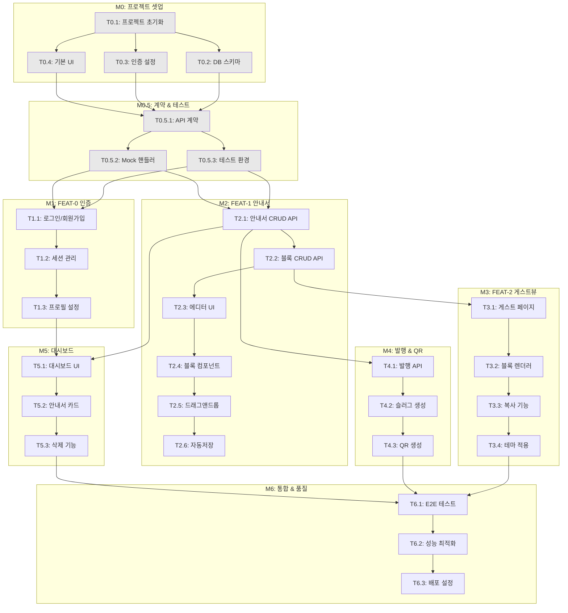

# TASKS: Roomy - 에어비앤비 호스트를 위한 디지털 안내서

> Contract-First TDD 기반 태스크 관리

---

## 마일스톤 개요

| 마일스톤 | 설명 | Phase | 상태 |
|----------|------|-------|------|
| M0 | 프로젝트 셋업 | Phase 0 | ⬜ 예정 |
| M0.5 | 계약 & 테스트 기반 | Phase 0 | ⬜ 예정 |
| M1 | FEAT-0: 인증/온보딩 | Phase 1 | ⬜ 예정 |
| M2 | FEAT-1: 안내서 생성/편집 | Phase 2 | ⬜ 예정 |
| M3 | FEAT-2: 게스트 뷰 | Phase 3 | ⬜ 예정 |
| M4 | 발행 & QR | Phase 4 | ⬜ 예정 |
| M5 | 대시보드 | Phase 5 | ⬜ 예정 |
| M6 | 통합 & 품질 | Phase 6 | ⬜ 예정 |

---

## 의존성 그래프



---

## 병렬 실행 가능 태스크

| 단계 | 병렬 실행 가능 태스크 | 비고 |
|------|----------------------|------|
| Phase 0 셋업 | T0.2, T0.3, T0.4 | T0.1 완료 후 |
| Phase 0.5 계약 | T0.5.2, T0.5.3 | T0.5.1 완료 후 |
| Phase 1-2 개발 | T1.1, T2.1 | Mock 사용으로 독립 개발 |
| Phase 2 에디터 | T2.3, T2.4 | UI와 블록 컴포넌트 병렬 |
| Phase 3-4 | T3.1, T4.1 | 게스트뷰와 발행 병렬 |

---

## M0: 프로젝트 셋업

### [ ] Phase 0, T0.1: 프로젝트 구조 초기화

**담당**: frontend-specialist

**작업 내용**:
- Next.js 14 프로젝트 생성 (App Router)
- TypeScript, TailwindCSS 설정
- 디렉토리 구조 생성
- ESLint, Prettier 설정
- package.json 의존성 추가

**산출물**:
- `frontend/package.json`
- `frontend/tsconfig.json`
- `frontend/tailwind.config.ts`
- `frontend/.eslintrc.json`
- `frontend/src/app/layout.tsx`
- `frontend/src/app/page.tsx`

**완료 조건**:
- [ ] `npm run dev` 실행 시 localhost:3000 정상 동작
- [ ] `npm run lint` 통과
- [ ] `npm run type-check` 통과

---

### [ ] Phase 0, T0.2: 데이터베이스 스키마 설정

**담당**: database-specialist

**의존성**: T0.1 완료 필요

**작업 내용**:
- Prisma 설치 및 초기화
- Supabase 연결 설정
- 04-database-design.md 기반 스키마 작성
- 마이그레이션 실행

**산출물**:
- `frontend/prisma/schema.prisma`
- `frontend/.env.example`
- `frontend/src/lib/server/prisma.ts`

**완료 조건**:
- [ ] `npx prisma db push` 성공
- [ ] `npx prisma studio` 에서 테이블 확인
- [ ] User, Guide, Block, GuideView 테이블 생성됨

---

### [ ] Phase 0, T0.3: 인증 서비스 설정 (Clerk)

**담당**: backend-specialist

**의존성**: T0.1 완료 필요

**작업 내용**:
- Clerk 프로젝트 생성 및 설정
- 환경 변수 설정
- middleware.ts 설정
- 인증 라우트 그룹 생성

**산출물**:
- `frontend/src/middleware.ts`
- `frontend/src/app/(auth)/sign-in/[[...sign-in]]/page.tsx`
- `frontend/src/app/(auth)/sign-up/[[...sign-up]]/page.tsx`
- `frontend/src/app/(auth)/layout.tsx`

**완료 조건**:
- [ ] /sign-in 페이지 접속 가능
- [ ] /sign-up 페이지 접속 가능
- [ ] Google OAuth 로그인 동작

---

### [ ] Phase 0, T0.4: 기본 UI 컴포넌트 설정

**담당**: frontend-specialist

**의존성**: T0.1 완료 필요

**작업 내용**:
- 05-design-system.md 기반 컴포넌트 생성
- Button, Input, Card 컴포넌트
- cn 유틸리티 함수
- globals.css 색상 변수 설정

**산출물**:
- `frontend/src/components/ui/Button.tsx`
- `frontend/src/components/ui/Input.tsx`
- `frontend/src/components/ui/Card.tsx`
- `frontend/src/components/ui/index.ts`
- `frontend/src/lib/utils/cn.ts`
- `frontend/src/app/globals.css`

**완료 조건**:
- [ ] Button 컴포넌트 (primary, secondary, ghost, danger)
- [ ] Input 컴포넌트 (label, error 상태)
- [ ] Card 컴포넌트
- [ ] 디자인 시스템 색상 적용됨

---

## M0.5: 계약 & 테스트 기반

### [ ] Phase 0, T0.5.1: API 계약 정의

**담당**: backend-specialist

**의존성**: T0.2, T0.3, T0.4 완료 필요

**작업 내용**:
- Zod 스키마로 API 계약 정의
- Guide, Block, User 계약
- 요청/응답 타입 정의

**산출물**:
- `frontend/src/contracts/types.ts`
- `frontend/src/contracts/guide.contract.ts`
- `frontend/src/contracts/block.contract.ts`
- `frontend/src/contracts/user.contract.ts`
- `frontend/src/contracts/index.ts`

**완료 조건**:
- [ ] 모든 API 엔드포인트 계약 정의됨
- [ ] TypeScript 타입 추출 가능
- [ ] 계약 테스트 작성 완료

---

### [ ] Phase 0, T0.5.2: MSW Mock 핸들러 생성

**담당**: test-specialist

**의존성**: T0.5.1 완료 필요

**작업 내용**:
- MSW 설치 및 설정
- 계약 기반 Mock 핸들러 작성
- Mock 데이터 생성

**산출물**:
- `frontend/src/mocks/browser.ts`
- `frontend/src/mocks/handlers/guides.ts`
- `frontend/src/mocks/handlers/blocks.ts`
- `frontend/src/mocks/handlers/users.ts`
- `frontend/src/mocks/handlers/index.ts`
- `frontend/src/mocks/data/guides.ts`
- `frontend/src/mocks/data/users.ts`
- `frontend/public/mockServiceWorker.js`

**완료 조건**:
- [ ] MSW 서비스 워커 등록됨
- [ ] 모든 API 엔드포인트 Mock 핸들러 존재
- [ ] 개발 환경에서 Mock 응답 확인 가능

---

### [ ] Phase 0, T0.5.3: 테스트 환경 설정

**담당**: test-specialist

**의존성**: T0.5.1 완료 필요

**작업 내용**:
- Vitest 설정
- React Testing Library 설정
- Playwright 설정
- 테스트 유틸리티 함수

**산출물**:
- `frontend/vitest.config.ts`
- `frontend/playwright.config.ts`
- `frontend/src/__tests__/setup.ts`
- `frontend/src/__tests__/contracts/guide.contract.test.ts`

**완료 조건**:
- [ ] `npm run test` 실행 가능
- [ ] 계약 테스트 통과
- [ ] `npx playwright test` 실행 가능

---

## M1: FEAT-0 인증/온보딩

### [ ] Phase 1, T1.1: 로그인/회원가입 페이지 RED→GREEN

**담당**: frontend-specialist

**의존성**: T0.5.2, T0.5.3 완료 필요 (Mock 사용으로 독립 개발)

**Git Worktree 설정**:
```bash
# 1. Worktree 생성
git worktree add ../roomy-phase1-auth -b phase/1-auth
cd ../roomy-phase1-auth

# 2. 작업 완료 후 병합
# git checkout main
# git merge phase/1-auth
# git worktree remove ../roomy-phase1-auth
```

**TDD 사이클**:

1. **RED**: 테스트 작성 (실패 확인)
   ```bash
   # 테스트 파일: frontend/src/__tests__/stores/auth.test.ts
   npm run test -- src/__tests__/stores/auth.test.ts  # Expected: FAILED
   ```

2. **GREEN**: 최소 구현 (테스트 통과)
   ```bash
   # 구현 파일: frontend/src/stores/auth.ts
   npm run test -- src/__tests__/stores/auth.test.ts  # Expected: PASSED
   ```

3. **REFACTOR**: 리팩토링 (테스트 유지)

**산출물**:
- `frontend/src/__tests__/stores/auth.test.ts` (테스트)
- `frontend/src/stores/auth.ts` (구현)
- `frontend/src/app/(auth)/sign-in/[[...sign-in]]/page.tsx`
- `frontend/src/app/(auth)/sign-up/[[...sign-up]]/page.tsx`

**인수 조건**:
- [ ] 테스트 먼저 작성됨 (RED 확인)
- [ ] 모든 테스트 통과 (GREEN)
- [ ] Clerk 컴포넌트 렌더링
- [ ] Google 로그인 버튼 동작
- [ ] 이메일 로그인 폼 동작

**완료 시 자동 실행**:
```bash
git add -A && git commit -m "$(cat <<'EOF'
기능: 로그인/회원가입 페이지 구현

- Clerk SignIn/SignUp 컴포넌트 적용
- Google OAuth 연동
- 이메일 로그인 폼 구현
- auth 스토어 테스트 작성

태스크: Phase 1, T1.1
EOF
)"
git checkout main && git merge phase/1-auth --no-ff -m "병합: Phase 1 - 인증"
git worktree remove ../roomy-phase1-auth && git branch -d phase/1-auth
```

---

### [ ] Phase 1, T1.2: 세션 관리 및 미들웨어 RED→GREEN

**담당**: backend-specialist

**의존성**: T1.1 완료 필요

**Git Worktree 설정**:
```bash
git worktree add ../roomy-phase1-session -b phase/1-session
cd ../roomy-phase1-session
```

**TDD 사이클**:

1. **RED**: 테스트 작성
   ```bash
   # 테스트 파일: frontend/src/__tests__/middleware/auth.test.ts
   npm run test -- src/__tests__/middleware/auth.test.ts
   ```

2. **GREEN**: 최소 구현
   ```bash
   # 구현 파일: frontend/src/middleware.ts
   # 구현 파일: frontend/src/app/api/[[...route]]/middleware/auth.ts
   ```

3. **REFACTOR**: 리팩토링

**산출물**:
- `frontend/src/__tests__/middleware/auth.test.ts`
- `frontend/src/middleware.ts`
- `frontend/src/app/api/[[...route]]/middleware/auth.ts`

**인수 조건**:
- [ ] 테스트 먼저 작성됨
- [ ] 보호된 라우트 접근 시 리다이렉트
- [ ] API 라우트 인증 미들웨어 동작
- [ ] 세션 만료 시 처리

---

### [ ] Phase 1, T1.3: 프로필 설정 페이지 RED→GREEN

**담당**: frontend-specialist

**의존성**: T1.2 완료 필요

**Git Worktree 설정**:
```bash
git worktree add ../roomy-phase1-profile -b phase/1-profile
cd ../roomy-phase1-profile
```

**TDD 사이클**:

1. **RED**: 테스트 작성
   ```bash
   # 테스트 파일: frontend/src/__tests__/components/ProfileSettings.test.tsx
   npm run test -- src/__tests__/components/ProfileSettings.test.tsx
   ```

2. **GREEN**: 최소 구현
   ```bash
   # 구현 파일: frontend/src/app/(protected)/settings/page.tsx
   ```

**산출물**:
- `frontend/src/__tests__/components/ProfileSettings.test.tsx`
- `frontend/src/app/(protected)/settings/page.tsx`
- `frontend/src/hooks/useUser.ts`

**인수 조건**:
- [ ] 테스트 먼저 작성됨
- [ ] 프로필 정보 표시
- [ ] 프로필 수정 기능
- [ ] 로그아웃 버튼 동작

---

## M2: FEAT-1 안내서 생성/편집

### [ ] Phase 2, T2.1: 안내서 CRUD API RED→GREEN

**담당**: backend-specialist

**의존성**: T0.5.2, T0.5.3 완료 필요 (Mock 사용으로 독립 개발)

**Git Worktree 설정**:
```bash
git worktree add ../roomy-phase2-guide-api -b phase/2-guide-api
cd ../roomy-phase2-guide-api
```

**TDD 사이클**:

1. **RED**: 테스트 작성
   ```bash
   # 테스트 파일: frontend/src/__tests__/api/guide.test.ts
   npm run test -- src/__tests__/api/guide.test.ts
   ```

2. **GREEN**: 최소 구현
   ```bash
   # 구현 파일: frontend/src/app/api/[[...route]]/routes/guide.ts
   ```

**산출물**:
- `frontend/src/__tests__/api/guide.test.ts`
- `frontend/src/app/api/[[...route]]/routes/guide.ts`
- `frontend/src/hooks/useGuide.ts`

**인수 조건**:
- [ ] GET /api/guides - 목록 조회
- [ ] POST /api/guides - 생성
- [ ] GET /api/guides/:id - 상세 조회
- [ ] PUT /api/guides/:id - 수정
- [ ] DELETE /api/guides/:id - 삭제
- [ ] 모든 테스트 통과

---

### [ ] Phase 2, T2.2: 블록 CRUD API RED→GREEN

**담당**: backend-specialist

**의존성**: T2.1 완료 필요

**Git Worktree 설정**:
```bash
git worktree add ../roomy-phase2-block-api -b phase/2-block-api
cd ../roomy-phase2-block-api
```

**TDD 사이클**:

1. **RED**: 테스트 작성
   ```bash
   # 테스트 파일: frontend/src/__tests__/api/block.test.ts
   npm run test -- src/__tests__/api/block.test.ts
   ```

2. **GREEN**: 최소 구현
   ```bash
   # 구현 파일: frontend/src/app/api/[[...route]]/routes/block.ts
   ```

**산출물**:
- `frontend/src/__tests__/api/block.test.ts`
- `frontend/src/app/api/[[...route]]/routes/block.ts`

**인수 조건**:
- [ ] POST /api/guides/:id/blocks - 블록 추가
- [ ] PUT /api/guides/:id/blocks/:blockId - 블록 수정
- [ ] DELETE /api/guides/:id/blocks/:blockId - 블록 삭제
- [ ] PUT /api/guides/:id/blocks/reorder - 순서 변경
- [ ] 모든 테스트 통과

---

### [ ] Phase 2, T2.3: 에디터 레이아웃 UI RED→GREEN

**담당**: frontend-specialist

**의존성**: T2.2 완료 필요

**Git Worktree 설정**:
```bash
git worktree add ../roomy-phase2-editor-ui -b phase/2-editor-ui
cd ../roomy-phase2-editor-ui
```

**TDD 사이클**:

1. **RED**: 테스트 작성
   ```bash
   # 테스트 파일: frontend/src/__tests__/components/EditorLayout.test.tsx
   npm run test -- src/__tests__/components/EditorLayout.test.tsx
   ```

2. **GREEN**: 최소 구현
   ```bash
   # 구현 파일: frontend/src/components/editor/EditorLayout.tsx
   ```

**산출물**:
- `frontend/src/__tests__/components/EditorLayout.test.tsx`
- `frontend/src/components/editor/EditorLayout.tsx`
- `frontend/src/components/editor/EditorHeader.tsx`
- `frontend/src/components/editor/BlockList.tsx`
- `frontend/src/components/editor/PreviewPanel.tsx`
- `frontend/src/app/(protected)/editor/[id]/page.tsx`

**인수 조건**:
- [ ] 3단 레이아웃 (블록 팔레트 | 편집 영역 | 미리보기)
- [ ] 헤더 (뒤로가기, 제목, 저장상태, 발행)
- [ ] 반응형 (모바일에서 단일 컬럼)
- [ ] 모든 테스트 통과

---

### [ ] Phase 2, T2.4: 블록 컴포넌트 구현 RED→GREEN

**담당**: frontend-specialist

**의존성**: T2.3과 병렬 가능 (Mock 사용)

**Git Worktree 설정**:
```bash
git worktree add ../roomy-phase2-blocks -b phase/2-blocks
cd ../roomy-phase2-blocks
```

**Mock 설정**:
```typescript
// frontend/src/mocks/blockMock.ts
export const mockBlocks = [
  { id: '1', type: 'text', content: { variant: 'heading', text: '환영합니다' } },
  { id: '2', type: 'copy', content: { label: '와이파이', value: 'ocean2024!' } },
];
```

**TDD 사이클**:

1. **RED**: 테스트 작성
   ```bash
   # 테스트 파일: frontend/src/__tests__/components/blocks/*.test.tsx
   npm run test -- src/__tests__/components/blocks
   ```

2. **GREEN**: 최소 구현
   ```bash
   # 구현 파일: frontend/src/components/blocks/editors/*.tsx
   ```

**산출물**:
- `frontend/src/__tests__/components/blocks/TextEditor.test.tsx`
- `frontend/src/__tests__/components/blocks/CopyEditor.test.tsx`
- `frontend/src/__tests__/components/blocks/ImageEditor.test.tsx`
- `frontend/src/__tests__/components/blocks/DividerEditor.test.tsx`
- `frontend/src/components/blocks/editors/TextEditor.tsx`
- `frontend/src/components/blocks/editors/CopyEditor.tsx`
- `frontend/src/components/blocks/editors/ImageEditor.tsx`
- `frontend/src/components/blocks/editors/DividerEditor.tsx`
- `frontend/src/components/blocks/BlockEditor.tsx`

**인수 조건**:
- [ ] TextEditor (heading, subheading, body)
- [ ] CopyEditor (라벨, 값, 아이콘)
- [ ] ImageEditor (업로드, 캡션)
- [ ] DividerEditor (스타일 선택)
- [ ] 모든 테스트 통과

---

### [ ] Phase 2, T2.5: 드래그앤드롭 구현 RED→GREEN

**담당**: frontend-specialist

**의존성**: T2.4 완료 필요

**Git Worktree 설정**:
```bash
git worktree add ../roomy-phase2-dnd -b phase/2-dnd
cd ../roomy-phase2-dnd
```

**TDD 사이클**:

1. **RED**: 테스트 작성
   ```bash
   # 테스트 파일: frontend/src/__tests__/hooks/useDragDrop.test.ts
   npm run test -- src/__tests__/hooks/useDragDrop.test.ts
   ```

2. **GREEN**: 최소 구현
   ```bash
   # 구현 파일: frontend/src/hooks/useDragDrop.ts
   # 적용: frontend/src/components/editor/BlockList.tsx
   ```

**산출물**:
- `frontend/src/__tests__/hooks/useDragDrop.test.ts`
- `frontend/src/hooks/useDragDrop.ts`
- `frontend/src/components/editor/BlockList.tsx` (수정)

**인수 조건**:
- [ ] @dnd-kit 적용
- [ ] 블록 순서 변경 가능
- [ ] 드래그 중 시각적 피드백
- [ ] 키보드 접근성
- [ ] 모든 테스트 통과

---

### [ ] Phase 2, T2.6: 자동저장 구현 RED→GREEN

**담당**: frontend-specialist

**의존성**: T2.5 완료 필요

**Git Worktree 설정**:
```bash
git worktree add ../roomy-phase2-autosave -b phase/2-autosave
cd ../roomy-phase2-autosave
```

**TDD 사이클**:

1. **RED**: 테스트 작성
   ```bash
   # 테스트 파일: frontend/src/__tests__/hooks/useAutoSave.test.ts
   npm run test -- src/__tests__/hooks/useAutoSave.test.ts
   ```

2. **GREEN**: 최소 구현
   ```bash
   # 구현 파일: frontend/src/hooks/useAutoSave.ts
   ```

**산출물**:
- `frontend/src/__tests__/hooks/useAutoSave.test.ts`
- `frontend/src/hooks/useAutoSave.ts`
- `frontend/src/components/editor/SaveStatus.tsx`
- `frontend/src/stores/editor.ts`

**인수 조건**:
- [ ] 변경 감지 (isDirty 상태)
- [ ] 디바운스 저장 (2초)
- [ ] 저장 상태 표시 (저장 중... / 저장됨)
- [ ] 에러 시 재시도
- [ ] 모든 테스트 통과

---

## M3: FEAT-2 게스트 뷰

### [ ] Phase 3, T3.1: 게스트 페이지 SSR RED→GREEN

**담당**: frontend-specialist

**의존성**: T2.2 완료 필요

**Git Worktree 설정**:
```bash
git worktree add ../roomy-phase3-guest -b phase/3-guest
cd ../roomy-phase3-guest
```

**TDD 사이클**:

1. **RED**: 테스트 작성
   ```bash
   # 테스트 파일: frontend/src/__tests__/pages/GuestView.test.tsx
   npm run test -- src/__tests__/pages/GuestView.test.tsx
   ```

2. **GREEN**: 최소 구현
   ```bash
   # 구현 파일: frontend/src/app/(guest)/g/[slug]/page.tsx
   ```

**산출물**:
- `frontend/src/__tests__/pages/GuestView.test.tsx`
- `frontend/src/app/(guest)/g/[slug]/page.tsx`
- `frontend/src/app/(guest)/g/[slug]/loading.tsx`
- `frontend/src/app/(guest)/g/[slug]/not-found.tsx`
- `frontend/src/app/(guest)/layout.tsx`

**인수 조건**:
- [ ] SSR 렌더링 (SEO 최적화)
- [ ] 로딩 상태 표시
- [ ] 404 처리
- [ ] 모바일 최적화
- [ ] LCP < 2.5초
- [ ] 모든 테스트 통과

---

### [ ] Phase 3, T3.2: 게스트 블록 렌더러 RED→GREEN

**담당**: frontend-specialist

**의존성**: T3.1 완료 필요

**Git Worktree 설정**:
```bash
git worktree add ../roomy-phase3-renderer -b phase/3-renderer
cd ../roomy-phase3-renderer
```

**TDD 사이클**:

1. **RED**: 테스트 작성
   ```bash
   # 테스트 파일: frontend/src/__tests__/components/guest/BlockRenderer.test.tsx
   npm run test -- src/__tests__/components/guest/BlockRenderer.test.tsx
   ```

2. **GREEN**: 최소 구현
   ```bash
   # 구현 파일: frontend/src/components/guest/BlockRenderer.tsx
   ```

**산출물**:
- `frontend/src/__tests__/components/guest/BlockRenderer.test.tsx`
- `frontend/src/components/guest/BlockRenderer.tsx`
- `frontend/src/components/guest/blocks/TextBlock.tsx`
- `frontend/src/components/guest/blocks/CopyBlock.tsx`
- `frontend/src/components/guest/blocks/ImageBlock.tsx`
- `frontend/src/components/guest/blocks/DividerBlock.tsx`

**인수 조건**:
- [ ] 모든 블록 타입 렌더링
- [ ] 읽기 전용 모드
- [ ] 반응형 레이아웃
- [ ] 모든 테스트 통과

---

### [ ] Phase 3, T3.3: 복사 기능 구현 RED→GREEN

**담당**: frontend-specialist

**의존성**: T3.2 완료 필요

**Git Worktree 설정**:
```bash
git worktree add ../roomy-phase3-copy -b phase/3-copy
cd ../roomy-phase3-copy
```

**TDD 사이클**:

1. **RED**: 테스트 작성
   ```bash
   # 테스트 파일: frontend/src/__tests__/components/guest/CopyBlock.test.tsx
   npm run test -- src/__tests__/components/guest/CopyBlock.test.tsx
   ```

2. **GREEN**: 최소 구현
   ```bash
   # 구현 파일: frontend/src/components/guest/blocks/CopyBlock.tsx
   ```

**산출물**:
- `frontend/src/__tests__/components/guest/CopyBlock.test.tsx`
- `frontend/src/components/guest/blocks/CopyBlock.tsx` (수정)
- `frontend/src/hooks/useClipboard.ts`

**인수 조건**:
- [ ] 원클릭 복사
- [ ] 복사 완료 토스트 메시지
- [ ] 복사 실패 시 에러 처리
- [ ] 모든 테스트 통과

---

### [ ] Phase 3, T3.4: 테마 적용 RED→GREEN

**담당**: frontend-specialist

**의존성**: T3.3 완료 필요

**Git Worktree 설정**:
```bash
git worktree add ../roomy-phase3-theme -b phase/3-theme
cd ../roomy-phase3-theme
```

**TDD 사이클**:

1. **RED**: 테스트 작성
   ```bash
   # 테스트 파일: frontend/src/__tests__/components/guest/ThemeProvider.test.tsx
   npm run test -- src/__tests__/components/guest/ThemeProvider.test.tsx
   ```

2. **GREEN**: 최소 구현
   ```bash
   # 구현 파일: frontend/src/components/guest/ThemeProvider.tsx
   ```

**산출물**:
- `frontend/src/__tests__/components/guest/ThemeProvider.test.tsx`
- `frontend/src/components/guest/ThemeProvider.tsx`
- `frontend/src/lib/theme/presets.ts`

**인수 조건**:
- [ ] 테마 색상 적용 (primary)
- [ ] 폰트 적용
- [ ] CSS 변수 주입
- [ ] 모든 테스트 통과

---

## M4: 발행 & QR

### [ ] Phase 4, T4.1: 발행 API RED→GREEN

**담당**: backend-specialist

**의존성**: T2.1 완료 필요

**Git Worktree 설정**:
```bash
git worktree add ../roomy-phase4-publish -b phase/4-publish
cd ../roomy-phase4-publish
```

**TDD 사이클**:

1. **RED**: 테스트 작성
   ```bash
   # 테스트 파일: frontend/src/__tests__/api/publish.test.ts
   npm run test -- src/__tests__/api/publish.test.ts
   ```

2. **GREEN**: 최소 구현
   ```bash
   # 구현 파일: frontend/src/app/api/[[...route]]/routes/guide.ts (publish 추가)
   ```

**산출물**:
- `frontend/src/__tests__/api/publish.test.ts`
- `frontend/src/app/api/[[...route]]/routes/guide.ts` (수정)

**인수 조건**:
- [ ] POST /api/guides/:id/publish - 발행
- [ ] POST /api/guides/:id/unpublish - 발행 취소
- [ ] isPublished 상태 업데이트
- [ ] 모든 테스트 통과

---

### [ ] Phase 4, T4.2: 슬러그 생성/검증 RED→GREEN

**담당**: backend-specialist

**의존성**: T4.1 완료 필요

**Git Worktree 설정**:
```bash
git worktree add ../roomy-phase4-slug -b phase/4-slug
cd ../roomy-phase4-slug
```

**TDD 사이클**:

1. **RED**: 테스트 작성
   ```bash
   # 테스트 파일: frontend/src/__tests__/lib/slug.test.ts
   npm run test -- src/__tests__/lib/slug.test.ts
   ```

2. **GREEN**: 최소 구현
   ```bash
   # 구현 파일: frontend/src/lib/server/slug.ts
   ```

**산출물**:
- `frontend/src/__tests__/lib/slug.test.ts`
- `frontend/src/lib/server/slug.ts`
- `frontend/src/components/editor/SlugInputModal.tsx`

**인수 조건**:
- [ ] 슬러그 자동 생성 (제목 기반)
- [ ] 슬러그 중복 검사
- [ ] 커스텀 슬러그 입력
- [ ] 유효성 검증 (영문, 숫자, 하이픈만)
- [ ] 모든 테스트 통과

---

### [ ] Phase 4, T4.3: QR 코드 생성 RED→GREEN

**담당**: frontend-specialist

**의존성**: T4.2 완료 필요

**Git Worktree 설정**:
```bash
git worktree add ../roomy-phase4-qr -b phase/4-qr
cd ../roomy-phase4-qr
```

**TDD 사이클**:

1. **RED**: 테스트 작성
   ```bash
   # 테스트 파일: frontend/src/__tests__/components/QRCode.test.tsx
   npm run test -- src/__tests__/components/QRCode.test.tsx
   ```

2. **GREEN**: 최소 구현
   ```bash
   # 구현 파일: frontend/src/components/common/QRCode.tsx
   ```

**산출물**:
- `frontend/src/__tests__/components/QRCode.test.tsx`
- `frontend/src/components/common/QRCode.tsx`
- `frontend/src/hooks/useQRCode.ts`

**인수 조건**:
- [ ] QR 코드 생성
- [ ] PNG 다운로드
- [ ] URL 복사 버튼
- [ ] 모든 테스트 통과

---

## M5: 대시보드

### [ ] Phase 5, T5.1: 대시보드 레이아웃 RED→GREEN

**담당**: frontend-specialist

**의존성**: T1.3, T2.1 완료 필요

**Git Worktree 설정**:
```bash
git worktree add ../roomy-phase5-dashboard -b phase/5-dashboard
cd ../roomy-phase5-dashboard
```

**TDD 사이클**:

1. **RED**: 테스트 작성
   ```bash
   # 테스트 파일: frontend/src/__tests__/pages/Dashboard.test.tsx
   npm run test -- src/__tests__/pages/Dashboard.test.tsx
   ```

2. **GREEN**: 최소 구현
   ```bash
   # 구현 파일: frontend/src/app/(protected)/dashboard/page.tsx
   ```

**산출물**:
- `frontend/src/__tests__/pages/Dashboard.test.tsx`
- `frontend/src/app/(protected)/dashboard/page.tsx`
- `frontend/src/components/dashboard/index.ts`

**인수 조건**:
- [ ] 안내서 목록 표시
- [ ] 빈 상태 처리
- [ ] 새 안내서 생성 버튼
- [ ] 반응형 그리드
- [ ] 모든 테스트 통과

---

### [ ] Phase 5, T5.2: 안내서 카드 컴포넌트 RED→GREEN

**담당**: frontend-specialist

**의존성**: T5.1 완료 필요

**Git Worktree 설정**:
```bash
git worktree add ../roomy-phase5-card -b phase/5-card
cd ../roomy-phase5-card
```

**TDD 사이클**:

1. **RED**: 테스트 작성
   ```bash
   # 테스트 파일: frontend/src/__tests__/components/GuideCard.test.tsx
   npm run test -- src/__tests__/components/GuideCard.test.tsx
   ```

2. **GREEN**: 최소 구현
   ```bash
   # 구현 파일: frontend/src/components/dashboard/GuideCard.tsx
   ```

**산출물**:
- `frontend/src/__tests__/components/GuideCard.test.tsx`
- `frontend/src/components/dashboard/GuideCard.tsx`

**인수 조건**:
- [ ] 안내서 정보 표시 (제목, 상태, 조회수)
- [ ] 썸네일 이미지
- [ ] 액션 메뉴 (수정, 미리보기, QR, 삭제)
- [ ] 발행 상태 뱃지
- [ ] 모든 테스트 통과

---

### [ ] Phase 5, T5.3: 안내서 삭제 기능 RED→GREEN

**담당**: frontend-specialist

**의존성**: T5.2 완료 필요

**Git Worktree 설정**:
```bash
git worktree add ../roomy-phase5-delete -b phase/5-delete
cd ../roomy-phase5-delete
```

**TDD 사이클**:

1. **RED**: 테스트 작성
   ```bash
   # 테스트 파일: frontend/src/__tests__/components/DeleteConfirmModal.test.tsx
   npm run test -- src/__tests__/components/DeleteConfirmModal.test.tsx
   ```

2. **GREEN**: 최소 구현
   ```bash
   # 구현 파일: frontend/src/components/common/DeleteConfirmModal.tsx
   ```

**산출물**:
- `frontend/src/__tests__/components/DeleteConfirmModal.test.tsx`
- `frontend/src/components/common/DeleteConfirmModal.tsx`

**인수 조건**:
- [ ] 삭제 확인 모달
- [ ] 삭제 후 목록 갱신
- [ ] 에러 처리
- [ ] 모든 테스트 통과

---

## M6: 통합 & 품질

### [ ] Phase 6, T6.1: E2E 테스트 작성

**담당**: test-specialist

**의존성**: T3.4, T4.3, T5.3 완료 필요

**Git Worktree 설정**:
```bash
git worktree add ../roomy-phase6-e2e -b phase/6-e2e
cd ../roomy-phase6-e2e
```

**작업 내용**:
- Playwright E2E 테스트 작성
- 핵심 사용자 흐름 테스트

**산출물**:
- `frontend/e2e/auth.spec.ts`
- `frontend/e2e/guide-creation.spec.ts`
- `frontend/e2e/guest-view.spec.ts`
- `frontend/e2e/fixtures.ts`

**인수 조건**:
- [ ] 회원가입 → 로그인 플로우
- [ ] 안내서 생성 → 편집 → 발행 플로우
- [ ] 게스트 뷰 접근 → 복사 플로우
- [ ] 모든 E2E 테스트 통과

---

### [ ] Phase 6, T6.2: 성능 최적화

**담당**: frontend-specialist

**의존성**: T6.1 완료 필요

**Git Worktree 설정**:
```bash
git worktree add ../roomy-phase6-perf -b phase/6-perf
cd ../roomy-phase6-perf
```

**작업 내용**:
- 이미지 최적화 (next/image)
- 번들 사이즈 분석
- 코드 스플리팅
- Lighthouse 점수 개선

**산출물**:
- 번들 분석 리포트
- 성능 개선 적용

**인수 조건**:
- [ ] 게스트 뷰 LCP < 2.5초
- [ ] 게스트 뷰 FCP < 1.5초
- [ ] Lighthouse Performance > 90
- [ ] 번들 사이즈 < 200KB (initial)

---

### [ ] Phase 6, T6.3: 배포 설정

**담당**: backend-specialist

**의존성**: T6.2 완료 필요

**Git Worktree 설정**:
```bash
git worktree add ../roomy-phase6-deploy -b phase/6-deploy
cd ../roomy-phase6-deploy
```

**작업 내용**:
- Vercel 프로젝트 설정
- 환경 변수 설정
- 도메인 설정
- CI/CD 파이프라인

**산출물**:
- `frontend/vercel.json`
- `.github/workflows/ci.yml` (선택)
- 배포 완료 URL

**인수 조건**:
- [ ] Vercel 배포 성공
- [ ] 환경 변수 설정 완료
- [ ] 프로덕션 URL 접근 가능
- [ ] HTTPS 적용

---

## 품질 게이트

### 병합 전 필수 체크

```bash
# 1. 린트
npm run lint

# 2. 타입 체크
npm run type-check

# 3. 단위 테스트
npm run test -- --coverage

# 4. E2E 테스트 (해당 시)
npx playwright test

# 5. 빌드
npm run build
```

### 커버리지 요구사항

| 영역 | 최소 커버리지 |
|------|-------------|
| contracts | 100% |
| hooks | 80% |
| components | 70% |
| api routes | 80% |

---

## Decision Log

| 날짜 | 결정 | 이유 |
|------|------|------|
| 2026-01-19 | Phase 0은 Worktree 불필요 | 초기 셋업은 main에서 직접 작업 |
| 2026-01-19 | Contract-First 접근 | BE/FE 독립 개발, 통합 용이 |
| 2026-01-19 | T2.3, T2.4 병렬 가능 | Mock 사용으로 의존성 해소 |
| 2026-01-19 | 한글 커밋 메시지 | 한국어 프로젝트, 가독성 |
